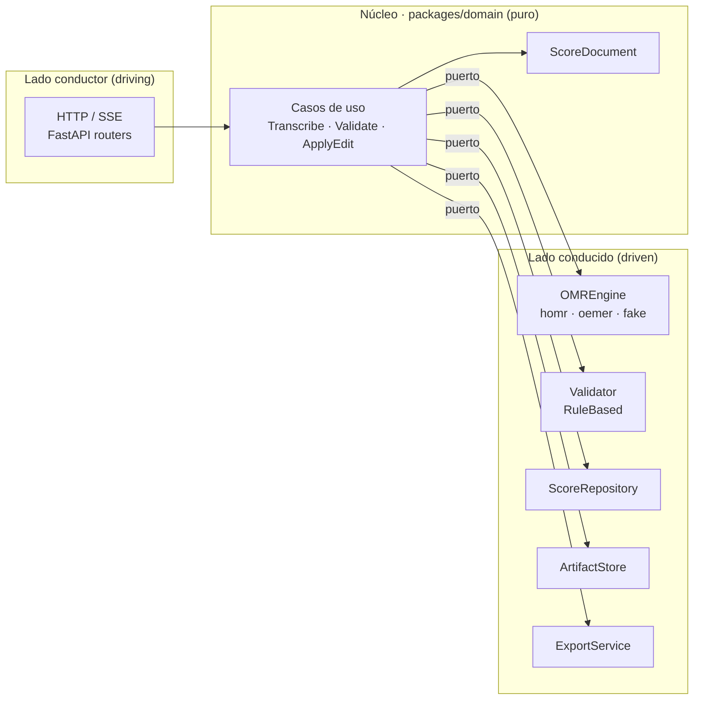
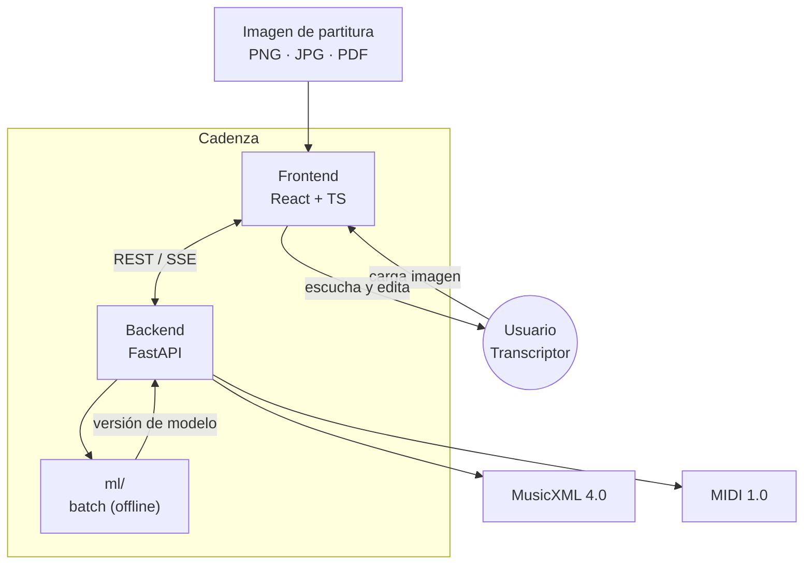
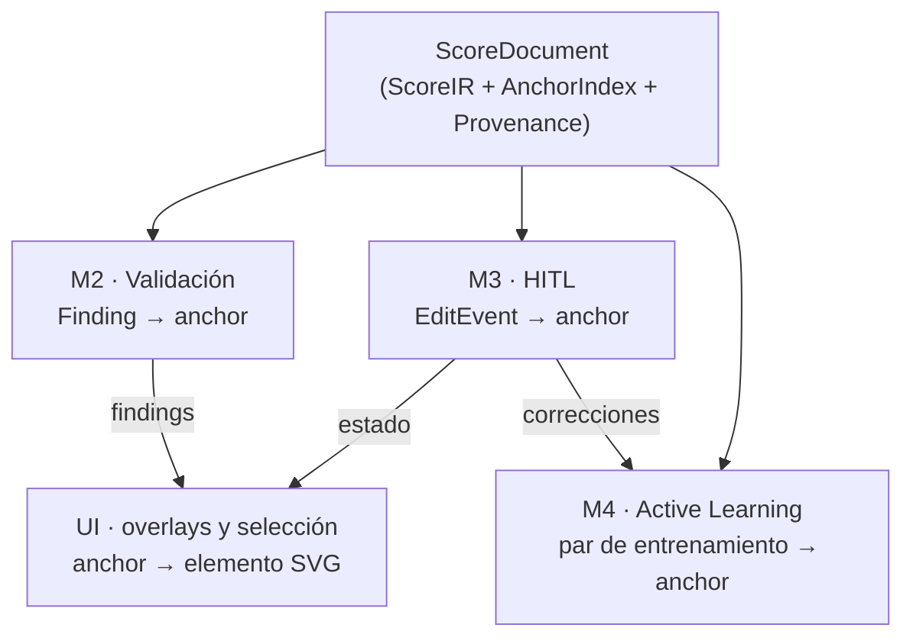
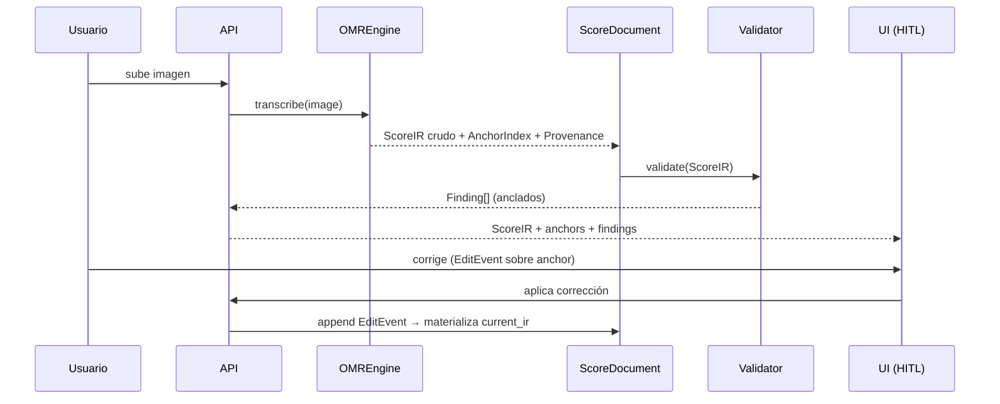
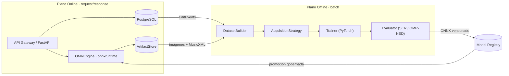
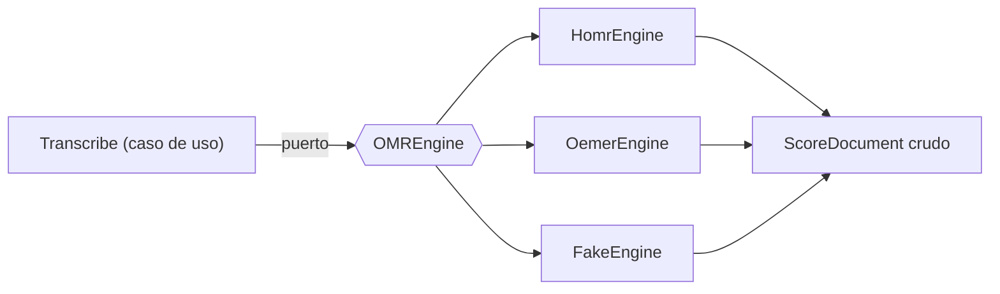
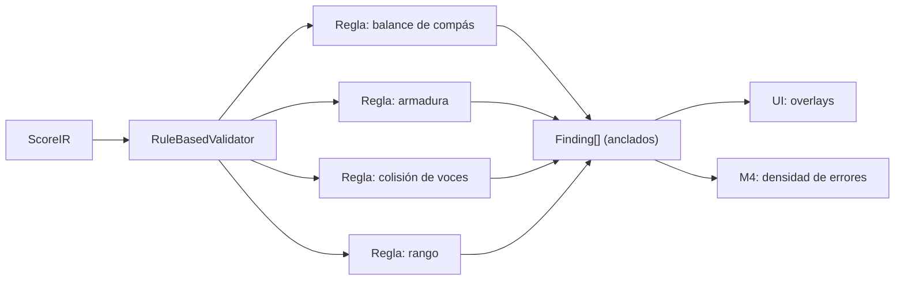
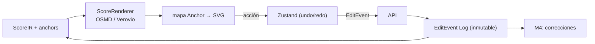

# Arquitectura de Software — Cadenza

**Plataforma de Digitalización Asistida de Partituras**

| Campo | Valor |
|---|---|
| **Documento** | Arquitectura de Software (ARCHITECTURE.md) |
| **Versión** | 1.0 |
| **Estado** | Aceptado — base para la implementación |
| **Fecha** | 2026-09-20 |
| **Autoría** | Arquitectura de Software, proyecto Cadenza |
| **Alcance** | Sistema completo (backend, frontend, planos de inferencia y aprendizaje) |

---

## Resumen

Cadenza transforma imágenes de partituras (fotografías y escaneos de obras
monofónicas y de piano simple) en formatos simbólicos editables y reproducibles
(**MusicXML 4.0** y **MIDI 1.0**), e integra cuatro pilares:

1. un **motor de transcripción OMR** (HOMR, sobre `onnxruntime`);
2. un **motor de validación sintáctica/semántica** basado en reglas de teoría
   musical (`music21`);
3. una **interfaz *Human-in-the-Loop* (HITL)** para corrección visual y escucha;
4. un **ciclo de aprendizaje activo** que recolecta pares de corrección para el
   *fine-tuning* por lotes del modelo de reconocimiento.

Este documento formaliza las decisiones estructurales que rigen la construcción
del sistema. No describe una implementación existente, sino la **arquitectura
objetivo desde cero**, derivada de los requisitos de la investigación y no de las
limitaciones del prototipo previo. Cada decisión relevante se respalda en un
*Architecture Decision Record* ([`adr/`](adr/)).

> **Nota de alcance.** Se excluyen explícitamente los enfoques basados en
> LLM/VLM y el *Edge Learning* / TFLite. El *fine-tuning* se realiza en el
> servidor, por lotes, sobre el modelo de reconocimiento.

---

## Índice

1. [Filosofía del diseño](#1-filosofía-del-diseño)
2. [El corazón simbólico: `ScoreDocument`](#2-el-corazón-simbólico-scoredocument)
3. [Separación de planos de cómputo](#3-separación-de-planos-de-cómputo)
4. [Stack tecnológico justificado](#4-stack-tecnológico-justificado)
5. [Diseño de los cuatro módulos de investigación](#5-diseño-de-los-cuatro-módulos-de-investigación)
6. [Estructura del repositorio](#6-estructura-del-repositorio)
7. [Atributos de calidad y estrategias](#7-atributos-de-calidad-y-estrategias)
8. [Plan de entrega por fases](#8-plan-de-entrega-por-fases)
9. [Registro de decisiones (ADR)](#9-registro-de-decisiones-adr)
10. [Glosario](#10-glosario)

---

## 1. Filosofía del diseño

### 1.1 Estilo arquitectónico: monolito modular hexagonal

Cadenza se construye como un **monolito modular con arquitectura hexagonal
(Puertos y Adaptadores)** ([ADR-0001](adr/ADR-0001-monolito-modular-hexagonal.md)).

Se descartan dos extremos. Los **monolitos en capas tradicionales** acoplan el
dominio a librerías concretas (`music21`, `homr`) y vuelven inviable sustituir
componentes. Los **microservicios** añaden complejidad operativa injustificada
para el alcance y el tiempo disponible. La opción intermedia —un único proceso
desplegable con fronteras internas estrictas— maximiza el valor académico: hace
**medible** cada componente sin distribuir el sistema.

Dos propiedades guían toda la estructura:

- **Bajo acoplamiento.** La interfaz, el modelo OMR y el validador evolucionan de
  forma independiente. El fallo o el reemplazo de uno no arrastra a los demás.
- **Comparabilidad experimental.** La tesis debe medir el pipeline asistido frente
  a una línea base OMR no asistida y comparar estrategias de aprendizaje activo
  entre sí. Esto solo es posible si cada componente de investigación es
  **intercambiable** sin reescribir el sistema.

### 1.2 El dominio en el centro

El **dominio** (`packages/domain`) es código **puro**: contiene el `ScoreDocument`,
las anclas, los `Finding` y los eventos de edición, y **no importa** I/O, ni
frameworks web, ni librerías de OMR. Todas las dependencias apuntan hacia
adentro; los adaptadores dependen del dominio, nunca al contrario.

### 1.3 Puertos y adaptadores

Cada capacidad externa se declara como un **puerto** (interfaz) y se implementa
mediante uno o varios **adaptadores**. Los puertos que sostienen la
investigación son `OMREngine` (línea base vs. motor principal), `Validator`
(catálogo de reglas) y `AcquisitionStrategy` (estrategias de aprendizaje activo
comparables).



### 1.4 Fronteras del sistema



---

## 2. El corazón simbólico: `ScoreDocument`

La decisión arquitectónica central de Cadenza es que **MusicXML no es la fuente
de verdad**. La fuente de verdad es el **`ScoreDocument`**, una estructura
compuesta de tres elementos
([ADR-0002](adr/ADR-0002-score-document-anchor-index.md)):

```
ScoreDocument = (ScoreIR, AnchorIndex, Provenance)
```

MusicXML pasa a ser **una serialización de entrada/salida**, no la representación
interna. El motivo es doble: sus identificadores de evento no son estables ni
obligatorios, y admite múltiples representaciones equivalentes de la misma
música, lo que rompe cualquier referencia cruzada entre módulos.

### 2.1 `ScoreIR` — representación intermedia simbólica

Notación normalizada construida sobre `music21`, que resuelve las ambigüedades de
MusicXML a una estructura canónica (partes, pentagramas, compases, voces y
eventos). Es la representación sobre la que operan las reglas de validación, el
diff y la derivación de datos de entrenamiento.

### 2.2 `AnchorIndex` — identificadores estables de evento

Un índice que asigna a cada evento musical un **ancla** entendida como **ruta
lógica** —no como índice de array ni como ID de MusicXML—:

```text
Anchor = {
  part:        int,      # índice de parte
  staff:       int,      # índice de pentagrama dentro de la parte
  measure:     int,      # número de compás lógico (1-based)
  voice:       int,      # índice de voz dentro del pentagrama
  event_index: int,      # posición del evento dentro de la voz
  staff_id:    string    # identificador estable de pentagrama (uuid determinista)
}
```

Propiedades exigidas al ancla:

- **Estabilidad:** deriva de la posición lógica (compás, voz, orden), no de
  punteros de memoria ni de IDs de MusicXML.
- **Determinismo:** dos parseos del mismo MusicXML producen las mismas anclas.
- **Metadatos opcionales:** puede portar `bbox` (coordenadas en la imagen
  original) y `confidence` (confianza del OMR), usados por la UI y por M4 sin ser
  obligatorios.
- **Direccionabilidad:** `Finding`, eventos de edición y pares de entrenamiento
  **solo** referencian eventos mediante anclas.

Las anclas son el **contrato compartido** entre los cuatro módulos:



### 2.3 `Provenance` — trazabilidad del origen

Metadatos que documentan de dónde proviene el documento y cada modificación:

- motor y **versión de modelo** de OMR que produjo el `ScoreIR`;
- versión del validador y reglas aplicadas;
- historial de ediciones humanas (referencias a `EditEvent`, [ADR-0007](adr/ADR-0007-edit-events-inmutables.md));
- hash de contenido del artefacto de imagen de origen.

`Provenance` es lo que permite **reproducir** un experimento indicando motor,
versión de modelo y reglas, requisito del capítulo experimental.

### 2.4 Ciclo de vida del documento



---

## 3. Separación de planos de cómputo

El sistema se divide en dos planos con perfiles de recurso incompatibles,
comunicados **únicamente por datos persistidos y artefactos versionados**
([ADR-0003](adr/ADR-0003-separacion-planos-computo.md)).

### 3.1 Plano Online (inferencia y UI)

- **Responsabilidad:** servir transcripción, validación, edición y exportación.
- **Tecnología:** FastAPI (async), `onnxruntime` (CPU/GPU), PostgreSQL,
  `ArtifactStore`.
- **Reglas:** ninguna operación de entrenamiento ocurre aquí; el trabajo pesado
  de OMR se ejecuta fuera del bucle de eventos; el dispositivo efectivo se
  reporta desde `onnxruntime.get_available_providers()`, **nunca** desde
  `torch.cuda`.

### 3.2 Plano Offline / Batch (aprendizaje)

- **Responsabilidad:** construir datasets, seleccionar muestras, hacer
  *fine-tuning* y evaluar.
- **Tecnología:** PyTorch (pipeline de HOMR), CLI de orquestación, `ml/`,
  configuraciones versionadas en `configs/`.
- **Reglas:** se ejecuta como **job explícito**; consume los eventos de edición
  persistidos; produce un **ONNX versionado** más un informe de evaluación.

### 3.3 Frontera entre planos



No existen llamadas síncronas del plano online hacia el offline. La mejora del
modelo es, por diseño, un ciclo **por lotes** y no un efecto inmediato del uso.

---

## 4. Stack tecnológico justificado

| Capa | Tecnología | Justificación |
|---|---|---|
| **Lenguaje backend** | Python 3.12 | Unifica el ecosistema simbólico (`music21`) y el de ML (PyTorch) en un solo lenguaje; compatible con HOMR (3.11/3.12). |
| **Entorno y dependencias** | `uv` + `pyproject.toml` | Reproducibilidad con *lockfile*; resolución rápida; separación limpia por plano. Reemplaza a los `requirements.txt` sueltos del MVP. |
| **API** | FastAPI + Pydantic v2 | Tipado, OpenAPI automático y soporte *async*; valida los *payloads* semi-estructurados antes de persistir. |
| **ORM y migraciones** | SQLAlchemy 2 + Alembic | Abstrae el motor y versiona el esquema; permite el *fallback* SQLite. |
| **Base de datos** | PostgreSQL + **JSONB** | Datos relacionales (sesiones, documentos) e **híbridos**: `Finding`, `anchor`, `EditEvent`, features de AL. JSONB permite consultar e indexar estructuras variables sin migraciones constantes. Concurrencia real entre planos ([ADR-0004](adr/ADR-0004-persistencia-postgresql-jsonb.md)). |
| **Artefactos** | `ArtifactStore` sobre filesystem *content-addressed* | Imágenes, MusicXML y ONNX fuera de la base de datos; direccionados por `sha256` → idempotencia y deduplicación. Migrable a S3/MinIO. |
| **Simbólico** | `music21 >= 10` + `musicdiff` | `music21` implementa el `ScoreIR` y el motor de reglas; `musicdiff` aporta el cálculo de diferencias simbólicas para SER/OMR-NED. `>=10` por compatibilidad con `numpy >= 2.4` de HOMR. |
| **OMR (inferencia)** | HOMR sobre `onnxruntime` (`homr[cpu]` / `homr[cuda]`) | Motor de dos etapas (segmentación UNet + transformer). GPU real vía `onnxruntime-gpu`; **no** vía `torch` ([ADR-0005](adr/ADR-0005-motor-omr-homr-baseline-oemer.md)). |
| **OMR (línea base)** | oemer (adaptador) | Permite el contraste experimental del sistema asistido frente a un OMR no asistido. |
| **Entrenamiento** | PyTorch (pipeline de HOMR) → export ONNX | Separación runtime/entrenamiento; reproducibilidad con semillas y config versionada. |
| **Renderizado musical** | OpenSheetMusicDisplay (OSMD) con mapa de anclas; Verovio como evolución | Render SVG fiable; **instrumentado** para exponer `Anchor → elemento`. La edición ocurre sobre el `ScoreIR`, no sobre el SVG ([ADR-0006](adr/ADR-0006-render-editor-osmd-verovio-zustand.md)). |
| **Estado frontend** | Zustand (editor) + TanStack Query (servidor) | Separa el estado editorial complejo (con undo/redo) de la caché remota; evita efectos colaterales del estado disperso del MVP. |
| **Audio** | Tone.js | Síntesis polifónica en el navegador y sincronización cursor↔audio. |
| **Frontend** | React 18 + TypeScript + Vite | Tipado de extremo a extremo; el editor se beneficia de tipos en anclas, findings y eventos. |
| **Calidad** | ruff + black + mypy + pytest (+ hypothesis); eslint + vitest + Playwright | Las reglas de teoría musical se prestan a *property-based testing*; los contratos de puertos se verifican con *tests* de arquitectura. |
| **Contenedores** | Docker Compose (online) + imagen CUDA separada (batch) | Materializa la separación de planos y garantiza entornos reproducibles. |
| **Configuración** | `pydantic-settings` + `.env` | Configuración 12-factor tipada y validada al arranque. |

### 4.1 Nota sobre versiones y conflictos

La compatibilidad del árbol de dependencias es una restricción de primer orden:
`homr` exige `numpy >= 2.4`, lo que obliga a `music21 >= 10`. Las versiones se
fijan por plano (runtime vs. entrenamiento) en un `pyproject.toml` con *lockfile*,
y la compatibilidad del artefacto ONNX entre ambos planos se verifica
explícitamente como parte del pipeline de promoción.

---

## 5. Diseño de los cuatro módulos de investigación

### Módulo 1 — `OMREngine`: motor de transcripción como adaptador

**Propósito.** Convertir una imagen de partitura en un `ScoreDocument` crudo
(`ScoreIR` + `AnchorIndex` + `Provenance`).

**Diseño.**

- Se declara el puerto `OMREngine.transcribe(image) -> ScoreDocument`.
- Adaptadores: `HomrEngine` (principal), `OemerEngine` (línea base),
  `FakeEngine` (pruebas y CI).
- Integración **in-process**, nunca por subprocess ni scraping de salida.
- El preprocesado (deskew, binarización, DPI) es una etapa configurable y
  medible dentro del adaptador.
- El dispositivo efectivo se reporta desde `onnxruntime` (`CUDAExecutionProvider`
  vs. `CPUExecutionProvider`).

**Aporte.** No es un modelo propio, sino una **capa de abstracción** que hace
experimentalmente comparable el motor y habilita la línea base.



---

### Módulo 2 — Validación con reglas puras registrables

**Propósito.** Detectar inconsistencias sintácticas y semánticas en el `ScoreIR`
y emitir hallazgos anclados.

**Diseño.**

- Motor de **reglas puras y registrables**:
  `Rule.evaluate(ScoreIR) -> list[Finding]`.
- Un `Finding` es `{anchor, rule_id, severity, message, suggested_fix?}`.
- Catálogo inicial (corpus monofónico y piano simple):
  - **balance de compás:** suma de duraciones = duración de la métrica;
  - **armadura y alteraciones:** consistencia; mismas armaduras entre
    pentagramas de piano;
  - **colisiones de voz:** sin solapamientos de tiempo en una misma voz;
  - **rango:** alturas dentro de un rango razonable;
  - **cierres:** ligaduras y elementos básicos bien cerrados.
- Cada regla se acompaña de **pruebas con partituras sintéticas** y, cuando
  aplica, *property-based testing*.
- El `Validator` es un puerto; la implementación inicial es
  `RuleBasedValidator`.

**Aporte.** Es el componente **central** de la contribución: formaliza reglas de
teoría musical como especificación verificable, y su salida (densidad de errores)
alimenta la señal del aprendizaje activo.



---

### Módulo 3 — Interfaz HITL basada en eventos inmutables sobre anclas

**Propósito.** Permitir al transcriptor revisar, escuchar y **corregir** la
transcripción, registrando cada corrección como dato estructurado.

**Diseño.**

- Las correcciones se modelan como **`EditEvent` inmutables** anclados a eventos
  musicales ([ADR-0007](adr/ADR-0007-edit-events-inmutables.md)): la secuencia de
  eventos se aplica sobre el `ScoreIR` crudo para materializar el estado actual.
- Operaciones iniciales: `SetPitch`, `SetDuration`, `SetAccidental`,
  `InsertEvent`, `DeleteEvent`, `SetClef`, `SetKey`.
- El renderizado (OSMD/Verovio) se **instrumenta** para exponer un mapa
  `Anchor → elemento SVG`, habilitando *overlays* de findings y selección.
- Reproducción con Tone.js y **cursor sincronizado** mediante un mapa
  tiempo→ancla derivado del `ScoreIR`.
- Imagen original en paralelo, con recorte por ancla cuando el OMR aporta `bbox`.
- Deshacer/rehacer se implementa desde el log de eventos.

**Aporte.** Captura el **proceso** de corrección (qué cambió, cuánto, desde qué
valor), insumo directo de M4 y de las métricas de esfuerzo cognitivo.



---

### Módulo 4 — Estrategia de Active Learning y Model Registry

**Propósito.** Usar las correcciones humanas para seleccionar las muestras de
mayor valor y mejorar progresivamente el reconocimiento.

**Diseño.**

- **`DatasetBuilder`:** traduce `(imagen, ScoreIR crudo, ScoreIR corregido,
  EditEvents)` a tuplas de entrenamiento compatibles con el pipeline de HOMR,
  alineando por anclas.
- **`AcquisitionStrategy` (puerto)** con implementaciones comparables
  ([ADR-0008](adr/ADR-0008-active-learning-model-registry.md)):
  - `UncertaintyAcquisition` — línea base para reproducir el hallazgo negativo de
    AL-003;
  - `DiversityAcquisition` — cobertura del espacio de características;
  - `HybridAcquisition` — **apuesta principal**: densidad de errores del
    validador + magnitud de corrección + diversidad.
- **`Trainer`:** *fine-tuning* en PyTorch con configuración versionada y semillas
  fijas; exportación a ONNX.
- **`Model Registry`:** versiones con métricas (`SER`, `OMR-NED`), versión de
  dataset y configuración; **promoción gobernada por umbral** hacia el plano
  online.

**Aporte.** Un ciclo de aprendizaje activo **justificado en la evidencia** y
diseñado como objeto de estudio experimental.


---

## 6. Estructura del repositorio

```text
cadenza/
├── apps/
│   ├── api/                 # FastAPI: routers, schemas, dependencias, SSE
│   └── web/                 # React + TS: editor, visor, audio, estado
├── packages/
│   ├── domain/              # ScoreDocument, Anchor, Finding, EditEvent (puro)
│   ├── omr/                 # puerto OMREngine + adaptadores homr/oemer/fake
│   ├── validation/          # motor de reglas + catálogo + tests
│   ├── persistence/         # repositorios SQLAlchemy, ArtifactStore
│   └── export/              # serialización MusicXML / MIDI
├── ml/                      # dataset builder, acquisition, train, eval
├── configs/                 # configuraciones de entrenamiento y experimentos
├── infra/                   # docker, compose, migraciones, CI
├── docs/                    # ARCHITECTURE.md, adr/, literatura/, DBB
└── pyproject.toml           # entorno y dependencias por plano
```

Regla de dependencias: `apps/*` y `ml/*` dependen de `packages/*`;
`packages/domain` no depende de ningún otro paquete del proyecto.

---

## 7. Atributos de calidad y estrategias

| Atributo | Estrategia arquitectónica |
|---|---|
| **Bajo acoplamiento** | Puertos y adaptadores; dominio puro; dirección de dependencias hacia el centro ([ADR-0001](adr/ADR-0001-monolito-modular-hexagonal.md)). |
| **Testeabilidad** | `FakeEngine` y reglas puras permiten probar sin GPU ni modelos; *property-based testing* para las reglas. |
| **Reproducibilidad** | `Provenance`, versión de modelo, dataset/fixtures direccionados por hash, configs y semillas ([ADR-0004](adr/ADR-0004-persistencia-postgresql-jsonb.md), [ADR-0008](adr/ADR-0008-active-learning-model-registry.md)). |
| **Comparabilidad experimental** | Puertos `OMREngine` y `AcquisitionStrategy` intercambiables. |
| **Mantenibilidad** | Monolito modular; fronteras verificadas por *tests* de arquitectura; tipado extremo a extremo. |
| **Rendimiento (online)** | Inferencia fuera del bucle de eventos; artefactos fuera de la base de datos; caché de modelos. |
| **Trazabilidad** | `EditEvent` inmutable + `Provenance`; auditoría completa. |
| **Portabilidad de cómputo** | CPU/GPU mediante `onnxruntime`; planos con imágenes separadas. |

---

## 8. Plan de entrega por fases

Cada fase es demostrable y no depende de las posteriores, lo que permite una
defensa incremental.

| Fase | Entregable | Módulos | Verificación |
|---|---|---|---|
| **F0** | Cimientos: `domain` (IR + anclas), `ArtifactStore`, esquema DB, puerto `OMREngine` con `FakeEngine`. | Transversal | Tests unitarios del dominio y de los contratos. |
| **F1** | OMR real (`HomrEngine`/`onnxruntime`) + export MusicXML/MIDI + evaluación base. | M1 | Transcripción de un corpus de prueba; SER/OMR-NED preliminar. |
| **F2** | Catálogo de reglas + motor de validación + `Finding` anclados. | M2 | Tests sintéticos por regla; métricas de precisión/recall del validador. |
| **F3** | Editor HITL con anclas, `EditEvent`, undo/redo, playback con cursor. | M3 | Prueba de corrección extremo a extremo; captura de esfuerzo. |
| **F4** | `DatasetBuilder` + `AcquisitionStrategy` + `Trainer` + `Model Registry`. | M4 | Job de *fine-tuning* reproducible y promoción con umbral. |
| **F5** | Experimentos: baseline vs. asistido; comparación de estrategias de AL. | Todos | Resultados y métricas para el capítulo experimental. |

---

## 9. Registro de decisiones (ADR)

| ID | Decisión |
|---|---|
| [ADR-0001](adr/ADR-0001-monolito-modular-hexagonal.md) | Monolito modular hexagonal (Puertos y Adaptadores) |
| [ADR-0002](adr/ADR-0002-score-document-anchor-index.md) | `ScoreDocument` con `AnchorIndex` como fuente de verdad |
| [ADR-0003](adr/ADR-0003-separacion-planos-computo.md) | Separación estricta de planos Online / Offline |
| [ADR-0004](adr/ADR-0004-persistencia-postgresql-jsonb.md) | Persistencia PostgreSQL + JSONB y `ArtifactStore` |
| [ADR-0005](adr/ADR-0005-motor-omr-homr-baseline-oemer.md) | HOMR/ONNX como motor base, oemer como línea base |
| [ADR-0006](adr/ADR-0006-render-editor-osmd-verovio-zustand.md) | Renderizado reactivo y estado editorial |
| [ADR-0007](adr/ADR-0007-edit-events-inmutables.md) | Correcciones HITL como eventos inmutables sobre anclas |
| [ADR-0008](adr/ADR-0008-active-learning-model-registry.md) | Estrategia de Active Learning y Model Registry |

---

## 10. Glosario

| Término | Definición |
|---|---|
| **Ancla (`Anchor`)** | Ruta lógica estable que identifica un evento musical y sirve de referencia compartida entre módulos. |
| **`ScoreDocument`** | Fuente de verdad del sistema: `ScoreIR` + `AnchorIndex` + `Provenance`. |
| **`ScoreIR`** | Representación intermedia simbólica normalizada, construida sobre `music21`. |
| **`Finding`** | Hallazgo de validación anclado a un evento, con severidad y diagnóstico. |
| **`EditEvent`** | Corrección humana inmutable, anclada, que describe una transformación sobre el `ScoreIR`. |
| **Puerto** | Interfaz abstracta que declara una capacidad externa en la arquitectura hexagonal. |
| **Adaptador** | Implementación concreta de un puerto (p. ej. `HomrEngine`). |
| **Plano Online** | Plano de inferencia y UI, orientado a peticiones. |
| **Plano Offline** | Plano de aprendizaje y entrenamiento, orientado a lotes. |
| **HITL** | *Human-in-the-Loop*: corrección humana asistida por el sistema. |
| **SER** | *Symbol Error Rate*: fracción de símbolos reconocidos incorrectamente. |
| **OMR-NED** | *Normalized Edit Distance* sobre la transcripción simbólica. |
| **Model Registry** | Catálogo versionado de modelos con métricas y control de promoción. |

---

*Este documento es la referencia arquitectónica oficial de Cadenza. Toda
modificación estructural debe acompañarse de un nuevo ADR en [`adr/`](adr/).*
