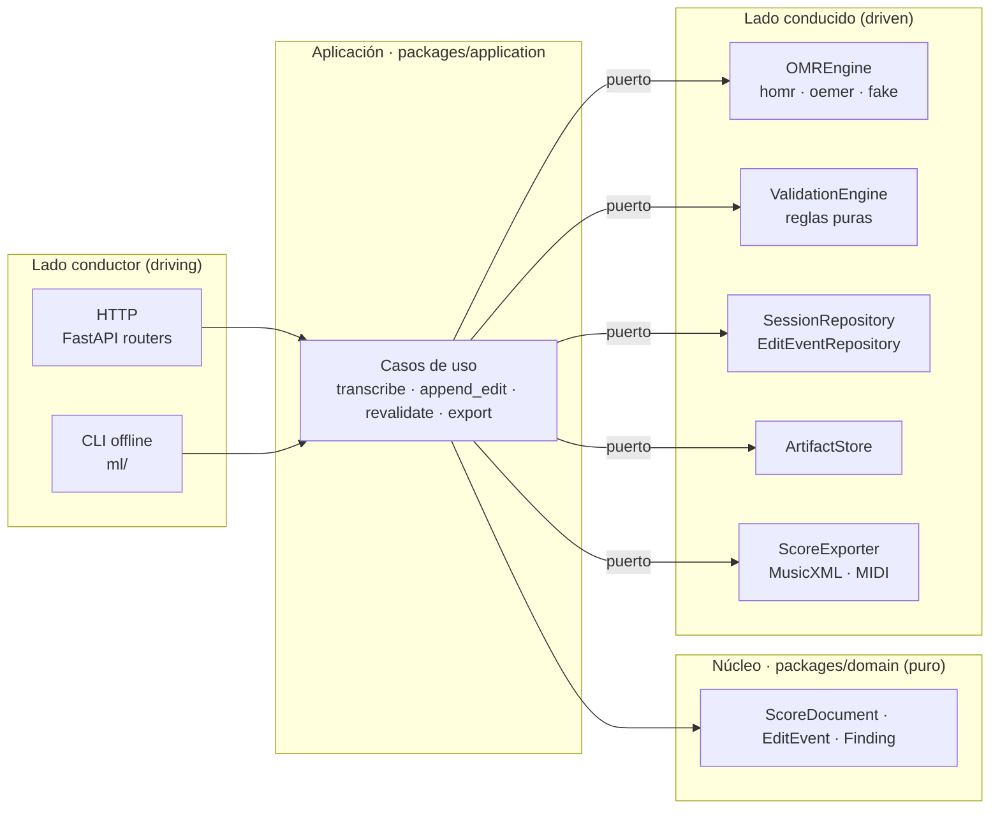
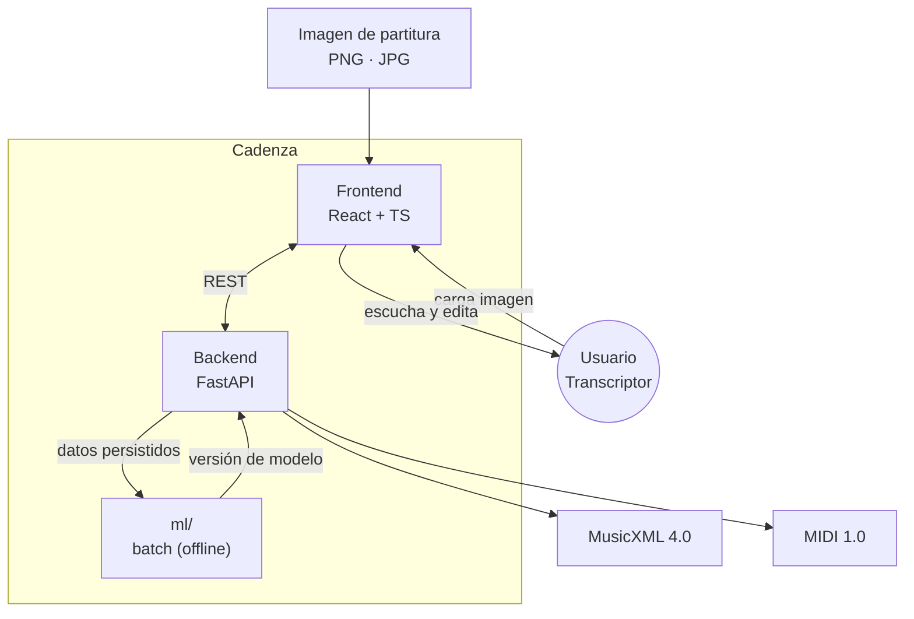
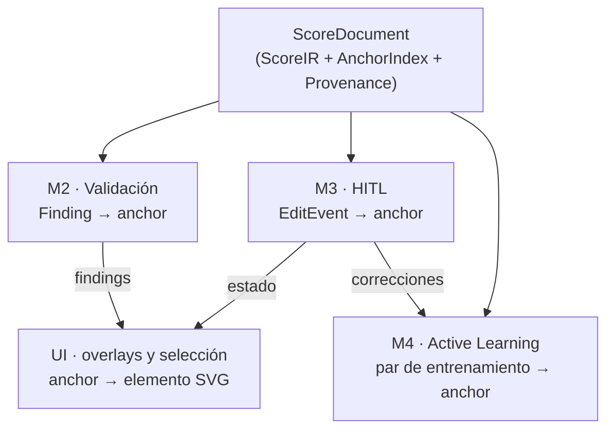
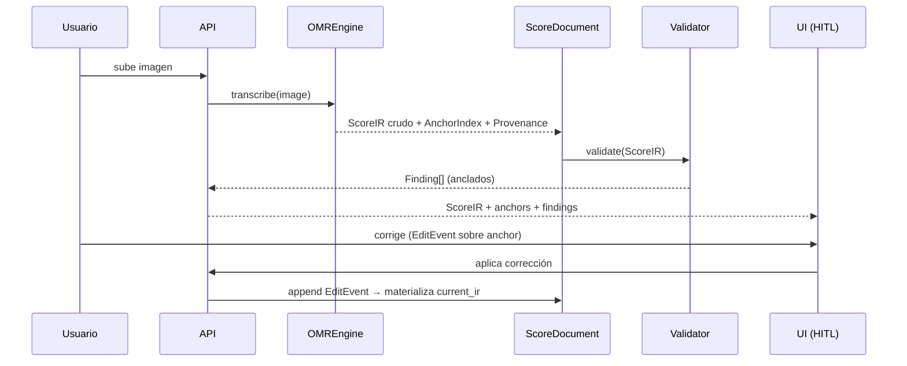
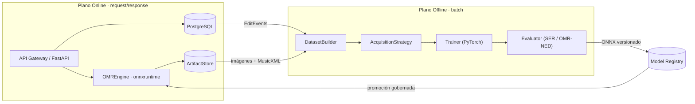
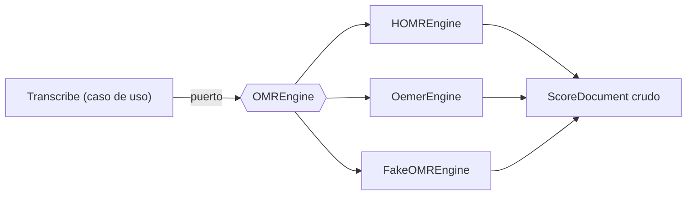
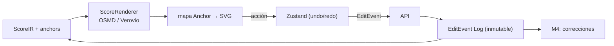
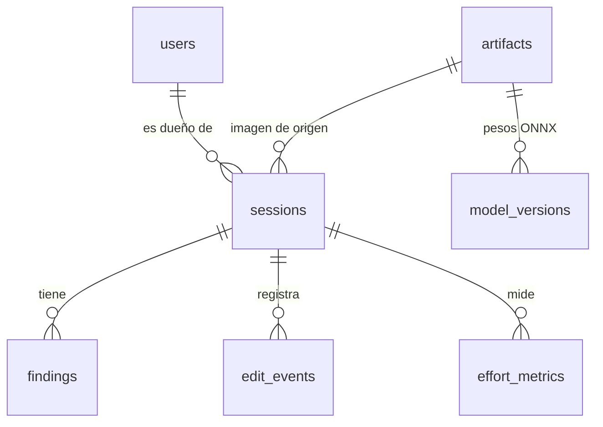

# Arquitectura de Software — Cadenza

**Plataforma de Digitalización Asistida de Partituras**

| Campo | Valor |
|---|---|
| **Documento** | Arquitectura de Software (ARCHITECTURE.md) |
| **Versión** | 1.2 |
| **Estado** | Aceptado — arquitectura objetivo vigente |
| **Fecha** | 2026-10-03 |
| **Autoría** | Arquitectura de Software, proyecto Cadenza |
| **Alcance** | Sistema completo (backend, frontend, planos de inferencia y aprendizaje) |

---

## Resumen

Cadenza transforma imágenes de partituras (fotografías y escaneos de obras
monofónicas y de piano simple) en formatos simbólicos editables y reproducibles
(**MusicXML 4.0** y **MIDI 1.0**), e integra cuatro pilares:

1. un **motor de transcripción OMR** (HOMR, sobre `onnxruntime`);
2. un **motor de validación sintáctica/semántica** basado en reglas puras de
   teoría musical sobre el `ScoreIR`;
3. una **interfaz *Human-in-the-Loop* (HITL)** para corrección visual y escucha;
4. un **ciclo de aprendizaje activo** que recolecta pares de corrección para el
   *fine-tuning* por lotes del modelo de reconocimiento.

Este documento formaliza las decisiones estructurales que rigen la construcción
del sistema. Describe la **arquitectura objetivo**, derivada de los requisitos de
la investigación y no de las limitaciones del prototipo previo. La implementación
actual cubre una parte de ella: la sección
[10](#10-estado-actual-frente-al-objetivo-y-plan-de-entrega) detalla qué existe,
qué falta y en qué orden se cierra la brecha. Cada decisión relevante se respalda
en un *Architecture Decision Record* ([`adr/`](adr/)).

> **Cambios de la versión 1.1.** Se añade la capa de aplicación
> ([ADR-0009](adr/ADR-0009-capa-de-aplicacion.md)), se fija la organización de
> los datos y el catálogo de funciones (secciones 6 y 7), el `ScoreIR` incorpora
> clave y armadura y la exportación pasa a `packages/interchange`
> ([ADR-0010](adr/ADR-0010-score-ir-atributos-y-exportacion.md)), y se corrige la
> descripción del `ScoreIR` y del validador, que no dependen de `music21`.
>
> **Cambios de la versión 1.2.** Se fija la semántica de las anclas ante
> inserciones y borrados ([ADR-0011](adr/ADR-0011-semantica-de-anclas-ante-ediciones.md)),
> se incorpora la autenticación con sesiones privadas por usuario
> ([ADR-0012](adr/ADR-0012-autenticacion-e-identidad.md)) y se acota la entrada a
> una imagen por sesión: la entrada PDF y las partituras de varias páginas quedan
> fuera del alcance.

> **Nota de alcance.** Se excluyen explícitamente los enfoques basados en
> LLM/VLM y el *Edge Learning* / TFLite. El *fine-tuning* se realiza en el
> servidor, por lotes, sobre el modelo de reconocimiento.

---

## Índice

1. [Filosofía del diseño](#1-filosofía-del-diseño)
2. [El corazón simbólico: `ScoreDocument`](#2-el-corazón-simbólico-scoredocument)
3. [Separación de planos de cómputo](#3-separación-de-planos-de-cómputo)
4. [Stack tecnológico justificado](#4-stack-tecnológico-justificado)
5. [Diseño de los cuatro módulos de investigación](#5-diseño-de-los-cuatro-módulos-de-investigación)
6. [Capa de aplicación y funciones](#6-capa-de-aplicación-y-funciones)
7. [Organización de los datos](#7-organización-de-los-datos)
8. [Estructura del repositorio](#8-estructura-del-repositorio)
9. [Atributos de calidad y estrategias](#9-atributos-de-calidad-y-estrategias)
10. [Estado actual frente al objetivo y plan de entrega](#10-estado-actual-frente-al-objetivo-y-plan-de-entrega)
11. [Registro de decisiones (ADR)](#11-registro-de-decisiones-adr)
12. [Glosario](#12-glosario)

---

## 1. Filosofía del diseño

### 1.1 Estilo arquitectónico: monolito modular hexagonal

Cadenza se construye como un **monolito modular con arquitectura hexagonal
(Puertos y Adaptadores)** ([ADR-0001](adr/ADR-0001-monolito-modular-hexagonal.md)).

Se descartan dos extremos. Los **monolitos en capas tradicionales** acoplan el
dominio a librerías concretas (`music21`, `homr`) y vuelven inviable sustituir
componentes. Los **microservicios** añaden complejidad operativa injustificada
para el alcance y el tiempo disponible. La opción intermedia —un único proceso
desplegable con fronteras internas estrictas— maximiza el valor académico: hace
**medible** cada componente sin distribuir el sistema.

Dos propiedades guían toda la estructura:

- **Bajo acoplamiento.** La interfaz, el modelo OMR y el validador evolucionan de
  forma independiente. El fallo o el reemplazo de uno no arrastra a los demás.
- **Comparabilidad experimental.** La tesis debe medir el pipeline asistido frente
  a una línea base OMR no asistida y comparar estrategias de aprendizaje activo
  entre sí. Esto solo es posible si cada componente de investigación es
  **intercambiable** sin reescribir el sistema.

### 1.2 El dominio en el centro

El **dominio** (`packages/domain`) es código **puro**: contiene el `ScoreDocument`,
las anclas, los `Finding` y los eventos de edición, y **no importa** I/O, ni
frameworks web, ni librerías de OMR. Todas las dependencias apuntan hacia
adentro; los adaptadores dependen del dominio, nunca al contrario.

### 1.3 Puertos y adaptadores

Cada capacidad externa se declara como un **puerto** (interfaz) y se implementa
mediante uno o varios **adaptadores**. Los puertos que sostienen la
investigación son `OMREngine` (línea base vs. motor principal), `ValidationRule`
(catálogo de reglas) y `AcquisitionStrategy` (estrategias de aprendizaje activo
comparables).



### 1.4 Fronteras del sistema



Cada sesión parte de **una sola imagen**. La entrada PDF y las partituras de
varias páginas quedan fuera del alcance: los corpus de evaluación son imágenes
de una página o menos, y admitirlas obligaría a añadir la página a las anclas y
a las coordenadas.

### 1.5 Capa de aplicación

Entre los conductores (API, CLI) y el dominio hay una **capa de aplicación**
(`packages/application`) que contiene los casos de uso
([ADR-0009](adr/ADR-0009-capa-de-aplicacion.md)). Un caso de uso orquesta
puertos y funciones del dominio para completar una operación del sistema; no
conoce HTTP ni SQL. Los *routers* de FastAPI solo traducen la petición, invocan
el caso de uso y traducen la respuesta. Así la API, los experimentos y los jobs
del plano offline ejecutan exactamente la misma lógica. El catálogo de casos de
uso está en la sección [6](#6-capa-de-aplicación-y-funciones).

---

## 2. El corazón simbólico: `ScoreDocument`

La decisión arquitectónica central de Cadenza es que **MusicXML no es la fuente
de verdad**. La fuente de verdad es el **`ScoreDocument`**, una estructura
compuesta de tres elementos
([ADR-0002](adr/ADR-0002-score-document-anchor-index.md)):

```
ScoreDocument = (ScoreIR, AnchorIndex, Provenance)
```

MusicXML pasa a ser **una serialización de entrada/salida**, no la representación
interna. El motivo es doble: sus identificadores de evento no son estables ni
obligatorios, y admite múltiples representaciones equivalentes de la misma
música, lo que rompe cualquier referencia cruzada entre módulos.

### 2.1 `ScoreIR` — representación intermedia simbólica

Notación normalizada como **estructuras inmutables propias del dominio**
(partes, pentagramas, compases, voces y eventos), sin dependencias externas. Es
la representación sobre la que operan las reglas de validación, la proyección
del log de ediciones y la derivación de datos de entrenamiento.

`music21` no forma parte del `ScoreIR`: queda confinado a
`packages/interchange`, que resuelve las ambigüedades de MusicXML/MEI/`**kern`
al leer y genera MusicXML/MIDI al exportar
([ADR-0010](adr/ADR-0010-score-ir-atributos-y-exportacion.md)). Para que la
exportación no pierda información, cada compás porta métrica, **clave** y
**armadura**, y cada evento su altura, duración y ligadura (estructura completa
en la sección [7.1](#71-modelo-simbólico)).

### 2.2 `AnchorIndex` — identificadores estables de evento

Un índice que asigna a cada evento musical un **ancla** entendida como **ruta
lógica** —no como índice de array ni como ID de MusicXML—:

```text
Anchor = {
  part:        int,      # índice de parte
  staff:       int,      # índice de pentagrama dentro de la parte
  measure:     int,      # número de compás lógico (1-based)
  voice:       int,      # índice de voz dentro del pentagrama
  event_index: int,      # posición del evento dentro de la voz
  staff_id:    string    # identificador estable de pentagrama (uuid determinista)
}
```

Propiedades exigidas al ancla:

- **Estabilidad:** deriva de la posición lógica (compás, voz, orden), no de
  punteros de memoria ni de IDs de MusicXML.
- **Determinismo:** dos parseos del mismo MusicXML producen las mismas anclas.
- **Metadatos opcionales:** puede portar `bbox` (coordenadas en la imagen
  original) y `confidence` (confianza del OMR), usados por la UI y por M4 sin ser
  obligatorios.
- **Direccionabilidad:** `Finding`, eventos de edición y pares de entrenamiento
  **solo** referencian eventos mediante anclas.

Las anclas son el **contrato compartido** entre los cuatro módulos:



**Anclas y ediciones estructurales.** `InsertEvent` y `DeleteEvent` desplazan la
posición de los eventos siguientes del mismo compás y la misma voz. Por eso toda
ancla es **relativa a un estado** de la sesión
([ADR-0011](adr/ADR-0011-semantica-de-anclas-ante-ediciones.md)): el índice del
documento persistido corresponde al estado `0` (documento crudo), el ancla de una
edición con `seq = n` se interpreta sobre el estado `n − 1`, y la de un hallazgo,
sobre su `at_seq`. La función pura `origin_anchor` traduce cualquier ancla al
evento del documento crudo, o indica que el evento fue insertado por una edición;
así cada evento del estado actual conserva su `bbox` y su procedencia.

### 2.3 `Provenance` — trazabilidad del origen

Metadatos que documentan de dónde proviene el documento y cada modificación:

- motor y **versión de modelo** de OMR que produjo el `ScoreIR`;
- versión del validador y reglas aplicadas;
- historial de ediciones humanas (referencias a `EditEvent`, [ADR-0007](adr/ADR-0007-edit-events-inmutables.md));
- hash de contenido del artefacto de imagen de origen.

`Provenance` es lo que permite **reproducir** un experimento indicando motor,
versión de modelo y reglas, requisito del capítulo experimental.

### 2.4 Ciclo de vida del documento



---

## 3. Separación de planos de cómputo

El sistema se divide en dos planos con perfiles de recurso incompatibles,
comunicados **únicamente por datos persistidos y artefactos versionados**
([ADR-0003](adr/ADR-0003-separacion-planos-computo.md)).

### 3.1 Plano Online (inferencia y UI)

- **Responsabilidad:** servir transcripción, validación, edición y exportación.
- **Tecnología:** FastAPI (async), `onnxruntime` (CPU/GPU), PostgreSQL,
  `ArtifactStore`.
- **Reglas:** ninguna operación de entrenamiento ocurre aquí; el trabajo pesado
  de OMR se ejecuta fuera del bucle de eventos mediante `asyncio.to_thread`
  (ADR-0016: transcripción síncrona de página única suficiente y sin colas
  distribuidas); el dispositivo efectivo se
  reporta desde `onnxruntime.get_available_providers()`, **nunca** desde
  `torch.cuda`.

### 3.2 Plano Offline / Batch (aprendizaje)

- **Responsabilidad:** construir datasets, seleccionar muestras, hacer
  *fine-tuning* y evaluar.
- **Tecnología:** PyTorch (pipeline de HOMR), CLI de orquestación, `ml/`,
  configuraciones versionadas en `configs/`.
- **Reglas:** se ejecuta como **job explícito**; consume los eventos de edición
  persistidos; produce un **ONNX versionado** más un informe de evaluación.

### 3.3 Frontera entre planos



No existen llamadas síncronas del plano online hacia el offline. La mejora del
modelo es, por diseño, un ciclo **por lotes** y no un efecto inmediato del uso.

---

## 4. Stack tecnológico justificado

| Capa | Tecnología | Justificación |
|---|---|---|
| **Lenguaje backend** | Python 3.12 | Unifica el ecosistema simbólico (`music21`) y el de ML (PyTorch) en un solo lenguaje; compatible con HOMR (3.11/3.12). |
| **Entorno y dependencias** | `uv` + `pyproject.toml` | Reproducibilidad con *lockfile*; resolución rápida; separación limpia por plano. Reemplaza a los `requirements.txt` sueltos del MVP. |
| **API** | FastAPI + Pydantic v2 | Tipado, OpenAPI automático y soporte *async*; valida los *payloads* semi-estructurados antes de persistir. |
| **ORM y migraciones** | SQLAlchemy 2 + Alembic | Abstrae el motor y versiona el esquema; permite el *fallback* SQLite. |
| **Base de datos** | PostgreSQL + **JSONB** | Datos relacionales (sesiones, documentos) e **híbridos**: `Finding`, `anchor`, `EditEvent`, features de AL. JSONB permite consultar e indexar estructuras variables sin migraciones constantes. Concurrencia real entre planos ([ADR-0004](adr/ADR-0004-persistencia-postgresql-jsonb.md)). |
| **Artefactos** | `ArtifactStore` sobre filesystem *content-addressed* | Imágenes, MusicXML y ONNX fuera de la base de datos; direccionados por `sha256` → idempotencia y deduplicación. Migrable a S3/MinIO. |
| **Simbólico** | `music21 >= 10` + `musicdiff` | `music21` se usa **solo** en `packages/interchange` como frontera de lectura y exportación (MusicXML/MEI/`**kern`/MIDI); el `ScoreIR` y las reglas son código propio sin dependencias. `musicdiff` aporta el cálculo de diferencias simbólicas para OMR-NED. `>=10` por compatibilidad con `numpy >= 2.4` de HOMR. |
| **OMR (inferencia)** | HOMR sobre `onnxruntime` (`homr[cpu]` / `homr[cuda]`) | Motor de dos etapas (segmentación UNet + transformer). GPU real vía `onnxruntime-gpu`; **no** vía `torch` ([ADR-0005](adr/ADR-0005-motor-omr-homr-baseline-oemer.md)). |
| **OMR (línea base)** | oemer (adaptador) | Permite el contraste experimental del sistema asistido frente a un OMR no asistido. |
| **Entrenamiento** | PyTorch (pipeline de HOMR) → export ONNX | Separación runtime/entrenamiento; reproducibilidad con semillas y config versionada. |
| **Renderizado musical** | OpenSheetMusicDisplay (OSMD) con mapa de anclas; Verovio como evolución | Render SVG fiable; **instrumentado** para exponer `Anchor → elemento`. La edición ocurre sobre el `ScoreIR`, no sobre el SVG ([ADR-0006](adr/ADR-0006-render-editor-osmd-verovio-zustand.md)). |
| **Estado frontend** | Zustand (editor) + TanStack Query (servidor) | Separa el estado editorial complejo (con undo/redo) de la caché remota; evita efectos colaterales del estado disperso del MVP. |
| **Audio** | Tone.js | Síntesis polifónica en el navegador y sincronización cursor↔audio. |
| **Frontend** | React 18 + TypeScript + Vite | Tipado de extremo a extremo; el editor se beneficia de tipos en anclas, findings y eventos. |
| **Calidad** | ruff + black + mypy + pytest (+ hypothesis); eslint + vitest + Playwright | Las reglas de teoría musical se prestan a *property-based testing*; los contratos de puertos se verifican con *tests* de arquitectura. |
| **Contenedores** | Docker Compose (online) + imagen CUDA separada (batch) | Materializa la separación de planos y garantiza entornos reproducibles. |
| **Configuración** | `pydantic-settings` + `.env` | Configuración 12-factor tipada y validada al arranque. |
| **Autenticación** | Usuario y contraseña + token de acceso JWT; Argon2id | Flujo estándar de FastAPI, documentado en OpenAPI; sin estado en el servidor ni datos personales ([ADR-0012](adr/ADR-0012-autenticacion-e-identidad.md)). |

### 4.1 Nota sobre versiones y conflictos

La compatibilidad del árbol de dependencias es una restricción de primer orden:
`homr` exige `numpy >= 2.4`, lo que obliga a `music21 >= 10`. Las versiones se
fijan por plano (runtime vs. entrenamiento) en un `pyproject.toml` con *lockfile*,
y la compatibilidad del artefacto ONNX entre ambos planos se verifica
explícitamente como parte del pipeline de promoción.

---

## 5. Diseño de los cuatro módulos de investigación

### Módulo 1 — `OMREngine`: motor de transcripción como adaptador

**Propósito.** Convertir una imagen de partitura en un `ScoreDocument` crudo
(`ScoreIR` + `AnchorIndex` + `Provenance`).

**Diseño.**

- Se declara el puerto `OMREngine.transcribe(image) -> ScoreDocument`.
- Adaptadores: `HOMREngine` (principal), `OemerEngine` (línea base),
  `FakeOMREngine` (pruebas y CI).
- El adaptador activo se elige por configuración (`CADENZA_OMR_ENGINE`), y el
  modelo que carga es la versión promovida en el *Model Registry*.
- Integración **in-process**, nunca por subprocess ni scraping de salida.
- El preprocesado (deskew, binarización, DPI) es una etapa configurable y
  medible dentro del adaptador.
- El dispositivo efectivo se reporta desde `onnxruntime` (`CUDAExecutionProvider`
  vs. `CPUExecutionProvider`).

**Aporte.** No es un modelo propio, sino una **capa de abstracción** que hace
experimentalmente comparable el motor y habilita la línea base.



---

### Módulo 2 — Validación con reglas puras registrables

**Propósito.** Detectar inconsistencias sintácticas y semánticas en el `ScoreIR`
y emitir hallazgos anclados.

**Diseño.**

- Motor de **reglas puras y registrables**:
  `ValidationRule.evaluate(ScoreDocument) -> list[Finding]`.
- Un `Finding` es `{anchor, rule_id, severity, message, suggested_fix?}`.
- Catálogo inicial (corpus monofónico y piano simple):
  - **balance de compás:** suma de duraciones = duración de la métrica;
  - **armadura y alteraciones:** consistencia; mismas armaduras entre
    pentagramas de piano;
  - **colisiones de voz:** sin solapamientos de tiempo en una misma voz;
  - **rango:** alturas dentro de un rango razonable;
  - **cierres:** ligaduras y elementos básicos bien cerrados.
- Cada regla se acompaña de **pruebas con partituras sintéticas** y, cuando
  aplica, *property-based testing*.
- `ValidationRule` es el puerto; `ValidationEngine` ejecuta el catálogo
  registrado y expone su `rules_version` para la `Provenance`.
- La validación se ejecuta al transcribir **y se repite tras las correcciones**
  sobre el `ScoreIR` materializado, de modo que los hallazgos reflejen el estado
  actual del documento.
- **Evaluación empírica sobre errores reales ([#18](https://github.com/sebdavid3/Cadenza/issues/18), D8):**
  Evaluado sobre 359 compases de 91 partituras de PrIMuS contra el diff simbólico
  con el ground truth (`exp_06_validation_metrics.py`), el catálogo obtiene una
  **precisión global de 64.52%**, **recall de 39.80%**, **F1 de 0.4923** y
  especificidad de 72.15% (con 71.19% de cobertura en errores de duración y 66.67%
  en alturas que descompensan la textura), confirmando la utilidad del catálogo
  simbólico y documentando analíticamente los límites intrínsecos de las reglas
  sintácticas frente a sustituciones musicalmente gramaticales.

**Aporte.** Es el componente **central** de la contribución: formaliza reglas de
teoría musical como especificación verificable, y su salida (densidad de errores)
alimenta la señal del aprendizaje activo.


---

### Módulo 3 — Interfaz HITL basada en eventos inmutables sobre anclas

**Propósito.** Permitir al transcriptor revisar, escuchar y **corregir** la
transcripción, registrando cada corrección como dato estructurado.

**Diseño.**

- Las correcciones se modelan como **`EditEvent` inmutables** anclados a eventos
  musicales ([ADR-0007](adr/ADR-0007-edit-events-inmutables.md)): la secuencia de
  eventos se aplica sobre el `ScoreIR` crudo para materializar el estado actual.
- Operaciones iniciales: `SetPitch`, `SetDuration`, `SetAccidental`,
  `InsertEvent`, `DeleteEvent`, `SetClef`, `SetKey`.
- El renderizado (OSMD/Verovio) se **instrumenta** para exponer un mapa
  `Anchor → elemento SVG`, habilitando *overlays* de findings y selección.
- Reproducción con Tone.js y **cursor sincronizado** mediante un mapa
  tiempo→ancla derivado del `ScoreIR`.
- Imagen original en paralelo, con recorte por ancla cuando el OMR aporta `bbox`.
- Deshacer/rehacer se implementa desde el log de eventos.

**Aporte.** Captura el **proceso** de corrección (qué cambió, cuánto, desde qué
valor), insumo directo de M4 y de las métricas de esfuerzo cognitivo.



---

### Módulo 4 — Estrategia de Active Learning y Model Registry

**Propósito.** Usar las correcciones humanas para seleccionar las muestras de
mayor valor y mejorar progresivamente el reconocimiento.

**Diseño.**

- **`DatasetBuilder` y `alignment`:** traduce `(imagen, ScoreIR crudo, ScoreIR corregido,
  EditEvents)` a tuplas de entrenamiento compatibles con el pipeline de HOMR,
  alineando compás a compás y voz a voz (`derive_edit_events`) para simular al
  corrector ideal y transformar de forma determinista la salida del OMR en el ground truth.
- **`AcquisitionStrategy` (puerto)** con implementaciones comparables
  ([ADR-0008](adr/ADR-0008-active-learning-model-registry.md)):
  - `UncertaintyAcquisition` — línea base para reproducir el hallazgo negativo de
    AL-003;
  - `DiversityAcquisition` — cobertura del espacio de características;
  - `HybridAcquisition` — **apuesta principal**: densidad de errores del
    validador + magnitud de corrección + diversidad.
- **`Trainer`:** *fine-tuning* en PyTorch con configuración versionada y semillas
  fijas; exportación a ONNX.
- **`Model Registry`:** versiones con métricas (`SER`, `OMR-NED`), versión de
  dataset y configuración; **promoción gobernada por umbral** hacia el plano
  online.

**Aporte.** Un ciclo de aprendizaje activo **justificado en la evidencia** y
diseñado como objeto de estudio experimental.


---

## 6. Capa de aplicación y funciones

Esta sección fija **qué hace el sistema** como catálogo de funciones. Las tablas
de estado (existe / pendiente) están en la sección
[10](#10-estado-actual-frente-al-objetivo-y-plan-de-entrega).

### 6.1 Casos de uso (`packages/application`)

| Caso de uso | Entrada → salida | Responsabilidad |
|---|---|---|
| `authenticate` | usuario, contraseña → token | Verifica las credenciales y emite un token de acceso de vida corta. |
| `create_user` | nombre, contraseña, rol → usuario | Da de alta una cuenta; solo lo puede hacer un investigador. |
| `update_user` | id, cambios → usuario | Restablece la contraseña de una cuenta o la desactiva; solo investigador. |
| `change_password` | contraseña actual, nueva → — | Cambia la contraseña del usuario actual. |
| `transcribe_score` | imagen → sesión | Guarda la imagen en el `ArtifactStore`, ejecuta el `OMREngine`, valida el documento y persiste sesión y hallazgos. |
| `list_sessions` | filtros, página → resúmenes | Lista las sesiones del usuario (todas, si es investigador) sin cargar el documento de cada una. |
| `get_session` | id → detalle de sesión | Devuelve el documento crudo, los hallazgos vigentes, el log de ediciones y el estado actual: su `seq`, el `ScoreIR` materializado y su índice de anclas. |
| `append_edit` | id, `base_seq`, edición → `EditEvent` | Rechaza la edición si `base_seq` no es el último `seq` de la sesión; comprueba que sea aplicable (`apply_edit` sobre el estado actual) y solo entonces la añade al log. |
| `undo_edit` | id → `EditEvent` | Revierte la última edición vigente añadiendo al log su evento inverso; nunca borra historia. |
| `revalidate` | id → hallazgos | Ejecuta el catálogo de reglas sobre el `ScoreIR` materializado y registra los hallazgos con el `seq` al que corresponden. |
| `dismiss_finding` | id, hallazgo → — | Marca un hallazgo como falso positivo; no reaparece mientras el evento señalado no cambie. |
| `finalize_session` | id → sesión | Cierra la corrección: revalida, fija el `seq` final y deja la sesión disponible para el plano offline. |
| `reopen_session` | id → sesión | Reabre una sesión finalizada permitiendo nuevas ediciones (#34, ADR-0014). |
| `export_score` | id, formato → bytes | Serializa el `ScoreIR` materializado a MusicXML 4.0 o MIDI 1.0. |
| `get_timing` | id → `TimingMap` | Calcula el mapa determinista de tiempo-ancla (inicio y duración en pulsos por ancla) para sincronizar el cursor de reproducción (#42, D12). |
| `record_effort` | id, métricas → — | Persiste las métricas de esfuerzo de la sesión de corrección. |

Reglas de la capa:

- Un caso de uso recibe sus puertos por inyección; no importa FastAPI ni
  SQLAlchemy.
- **Ninguna edición inválida entra al log.** Como el log es *append-only*
  ([ADR-0007](adr/ADR-0007-edit-events-inmutables.md)), una edición que no puede
  proyectarse dejaría la sesión sin estado materializado de forma permanente.
- **Todo caso de uso recibe el usuario actual** (identificador y rol). La regla
  de propiedad vive en esta capa: un transcriptor solo accede a sus sesiones y
  una sesión ajena se trata como inexistente; un investigador puede leerlas
  todas ([ADR-0012](adr/ADR-0012-autenticacion-e-identidad.md)).
- El autor de cada edición lo fija el servidor a partir del usuario actual; el
  cliente no lo envía.
- Los errores se expresan como excepciones de aplicación (`NotAuthenticated`,
  `Forbidden`, `SessionNotFound`, `InvalidEdit`, `SequenceConflict`) que el
  conductor traduce (401, 403, 404, 422, 409).

### 6.2 Puertos

| Puerto | Operaciones | Adaptadores |
|---|---|---|
| `OMREngine` | `transcribe(image_path) -> ScoreDocument` | `HOMREngine`, `OemerEngine`, `FakeOMREngine` |
| `ValidationRule` | `evaluate(document) -> list[Finding]` | Balance de compás, armadura y alteraciones, colisión de voces, rango, cierres |
| `SessionRepository` | `add`, `get`, `list`, `update_status`, `list_findings`, `replace_findings` | SQLAlchemy |
| `EditEventRepository` | `next_seq`, `append`, `list_events` | SQLAlchemy |
| `UserRepository` | `add`, `get`, `get_by_username` | SQLAlchemy |
| `PasswordHasher` | `hash(password)`, `verify(password, hash)` | Argon2id |
| `TokenService` | `issue(user) -> token`, `verify(token) -> user` | JWT firmado |
| `ArtifactStore` | `put(bytes, kind) -> sha256`, `get(sha256) -> bytes`, `exists(sha256)` | Sistema de archivos direccionado por contenido |
| `ScoreExporter` | `to_musicxml(score) -> str`, `to_midi(score) -> bytes` | `packages/interchange` (`music21`) |
| `AcquisitionStrategy` | `select(candidates, budget) -> list[TrainingSample]` | Incertidumbre, diversidad, híbrida |
| `Trainer` | `train(samples, config) -> TrainedArtifact` | `FakeTrainer`, entrenador PyTorch |
| `ModelRegistry` | `register`, `promote`, `active`, `versions` | En memoria (pruebas), SQLAlchemy |

### 6.3 Funciones puras del dominio

| Función | Propósito |
|---|---|
| `build_anchor_index(score)` | Deriva el índice de anclas de forma determinista. |
| `apply_edit(score, edit)` | Devuelve un nuevo `ScoreIR` con una edición aplicada. |
| `materialize(score, edits)` | Reconstruye el estado actual aplicando el log en orden de `seq`. |
| `origin_anchor(anchor, at_seq, edits)` | Traduce un ancla de cualquier estado al evento del documento crudo, o indica que fue insertado por una edición. |

### 6.4 API REST (plano online)

| Método | Endpoint | Caso de uso |
|---|---|---|
| `POST` | `/auth/login` | `authenticate` |
| `GET` | `/auth/me` | usuario actual |
| `POST` | `/auth/password` | `change_password` |
| `GET` | `/users` | listado de cuentas (investigador) |
| `POST` | `/users` | `create_user` |
| `PATCH` | `/users/{id}` | `update_user` |
| `POST` | `/transcribe` | `transcribe_score` |
| `GET` | `/sessions` | `list_sessions` |
| `GET` | `/sessions/{id}` | `get_session` |
| `GET` | `/sessions/{id}/findings` | `get_session` (solo hallazgos) |
| `GET` | `/sessions/{id}/image` | lectura del `ArtifactStore` |
| `POST` | `/sessions/{id}/edits` | `append_edit` |
| `POST` | `/sessions/{id}/undo` | `undo_edit` |
| `POST` | `/sessions/{id}/validate` | `revalidate` |
| `POST` | `/sessions/{id}/findings/{finding_id}/dismiss` | `dismiss_finding` |
| `POST` | `/sessions/{id}/finalize` | `finalize_session` |
| `POST` | `/sessions/{id}/reopen` | `reopen_session` |
| `GET` | `/sessions/{id}/export?format=musicxml\|midi` | `export_score` |
| `GET` | `/sessions/{id}/timing` | `get_timing` |
| `POST` | `/sessions/{id}/effort` | `record_effort` |
| `GET` | `/health` | comprobación de salud y dependencias (#40, D44, ADR-0015) |
| `GET` | `/version` | versión de contrato de API y aplicación |


Todos los endpoints exigen un token de acceso (`Authorization: Bearer`), salvo
`/auth/login`. El contrato se publica como OpenAPI y de él se generan los tipos
TypeScript del frontend. La inferencia OMR se ejecuta fuera del bucle de eventos.

### 6.5 Jobs del plano offline (CLI en `ml/`)

| Comando | Función |
|---|---|
| `build-dataset` | Lee sesiones y `EditEvent` de la base de datos y produce muestras de entrenamiento con su `dataset_hash`. |
| `select` | Aplica una `AcquisitionStrategy` con un presupuesto. |
| `train` | Ajusta el modelo con una configuración versionada y exporta ONNX al `ArtifactStore`. |
| `evaluate` | Calcula SER y OMR-NED contra el corpus de evaluación. |
| `promote` | Registra la versión y la activa solo si supera el umbral. |
| `run` | Ejecuta el pipeline completo de punta a punta de forma encadenada. |

---

## 7. Organización de los datos

### 7.1 Modelo simbólico

```text
ScoreDocument
├── id
├── score: ScoreIR
│   └── Part(id)
│       └── Staff(id)
│           └── Measure(number, time_signature, clef, key_signature)
│               └── Event(kind, voice, pitch, duration_beats, tie,
│                         bbox?, confidence?, ir_handle?)
├── anchors: AnchorIndex          # Anchor -> EventRef
└── provenance: Provenance        # omr_engine, model_version, rules_version,
                                  # source_image_hash, created_at
```

Todas las estructuras son inmutables y serializables con
`to_primitive`/`from_primitive`. Las duraciones son fracciones exactas.

### 7.2 Modelo relacional (PostgreSQL + JSONB)

Este esquema concreta el esquema conceptual del
[ADR-0004](adr/ADR-0004-persistencia-postgresql-jsonb.md): sesión y documento
comparten tabla, y las muestras de aprendizaje activo no se persisten porque el
job `build-dataset` las deriva del log.

| Tabla | Columnas principales | Contenido |
|---|---|---|
| `users` | `id`, `username`, `password_hash`, `role`, `active`, `created_at` | Cuentas de usuario. `role` es `transcriptor` o `investigador`; no se guardan datos personales. |
| `sessions` | `id`, `owner_id` → `users`, `document_id`, `omr_engine`, `model_version`, `status`, `validated_at_seq`, `condition`, `test_score_id`, `image_artifact` → `artifacts`, `document` (JSONB), `created_at` | Una transcripción. `condition` distingue la condición experimental (`assisted` con validador vs `unassisted` sin validador); `test_score_id` referencia la partitura de prueba del estudio. `document` guarda el `ScoreDocument` **crudo** del OMR y no se modifica. `status` sigue el ciclo transcrita → en corrección → finalizada (o fallida). |
| `findings` | `id`, `session_id`, `at_seq`, `rule_id`, `severity`, `message`, `suggested_fix`, `anchor` (JSONB), `resolution` | Hallazgos de validación. `at_seq` indica sobre qué punto del log se calcularon (0 = documento crudo); `resolution` distingue los vigentes de los descartados por el usuario. |
| `edit_events` | `id`, `session_id`, `seq`, `op`, `author`, `anchor`, `before`, `after` (JSONB), `created_at` | Log *append-only* de correcciones. `UNIQUE(session_id, seq)`; sin `UPDATE` ni `DELETE`. `author` lo fija el servidor con el usuario autenticado. |
| `effort_metrics` | `id`, `session_id`, `duration_ms`, `time_to_first_edit_ms`, `interventions` (JSONB), `created_at` | Esfuerzo de corrección por sesión. |
| `artifacts` | `sha256` (PK), `kind`, `media_type`, `size_bytes`, `path`, `created_at` | Índice del `ArtifactStore`. |
| `model_versions` | `version` (PK), `artifact_hash` → `artifacts`, `dataset_hash`, `config_hash`, `ser`, `omr_ned`, `promoted`, `created_at` | *Model Registry* persistente. |



El **estado actual** de una partitura no se almacena: se obtiene con
`materialize(document.score, edit_events)`. El esquema se versiona con Alembic y
SQLite queda como *fallback* para pruebas.

### 7.3 Artefactos y archivos

```text
data/artifacts/sha256/ab/cd/<hash>   # imágenes, MusicXML, ONNX (direccionado por contenido)
data/<corpus>/                       # corpus de evaluación + manifiesto con hashes
configs/learning/*.json              # configuraciones de entrenamiento versionadas
results/                             # salidas de experimentos (no versionadas)
```

Los binarios nunca se guardan en la base de datos; la base solo referencia su
`sha256`, lo que da idempotencia y deduplicación.

---

## 8. Estructura del repositorio

```text
cadenza/
├── apps/
│   ├── api/                 # FastAPI: routers, schemas, composición de dependencias
│   └── web/                 # React + TS: editor, visor, audio, estado
├── packages/
│   ├── domain/              # ScoreDocument, Anchor, Finding, EditEvent, proyección (puro)
│   ├── application/         # casos de uso y puertos de aplicación
│   ├── interchange/         # MusicXML/MEI/**kern ↔ ScoreIR y exportación MusicXML/MIDI
│   ├── omr/                 # puerto OMREngine + adaptadores homr/oemer/fake
│   ├── validation/          # motor de reglas + catálogo + tests
│   ├── persistence/         # repositorios SQLAlchemy, ArtifactStore, migraciones Alembic
│   └── learning/            # dataset, adquisición, entrenamiento, métricas, registry
├── ml/                      # CLI de jobs offline y experimentos de la tesis
├── configs/                 # configuraciones de entrenamiento y experimentos
├── docs/                    # ARCHITECTURE.md, adr/, literatura/, DBB
├── legacy/                  # prototipo MVP original (referencia, no producción)
└── pyproject.toml           # workspace uv y configuración única de calidad
```

Regla de dependencias: `apps/*` y `ml/*` dependen de `packages/*`;
`packages/application` depende de `packages/domain` y de los puertos, nunca de
adaptadores concretos; `packages/domain` no depende de ningún otro paquete.

---

## 9. Atributos de calidad y estrategias

| Atributo | Estrategia arquitectónica |
|---|---|
| **Bajo acoplamiento** | Puertos y adaptadores; dominio puro; dirección de dependencias hacia el centro ([ADR-0001](adr/ADR-0001-monolito-modular-hexagonal.md)). |
| **Testeabilidad** | `FakeOMREngine` y reglas puras permiten probar sin GPU ni modelos; *property-based testing* para las reglas. |
| **Reproducibilidad** | `Provenance`, versión de modelo, dataset/fixtures direccionados por hash, configs y semillas ([ADR-0004](adr/ADR-0004-persistencia-postgresql-jsonb.md), [ADR-0008](adr/ADR-0008-active-learning-model-registry.md)). |
| **Comparabilidad experimental** | Puertos `OMREngine` y `AcquisitionStrategy` intercambiables. |
| **Mantenibilidad** | Monolito modular; fronteras verificadas por *tests* de arquitectura; tipado extremo a extremo. |
| **Rendimiento (online)** | Inferencia fuera del bucle de eventos; artefactos fuera de la base de datos; caché de modelos. |
| **Trazabilidad** | `EditEvent` inmutable + `Provenance`; auditoría completa. |
| **Portabilidad de cómputo** | CPU/GPU mediante `onnxruntime`; planos con imágenes separadas. |
| **Seguridad** | Autenticación en todos los endpoints, sesiones privadas por usuario, contraseñas con Argon2id y autoría fijada por el servidor ([ADR-0012](adr/ADR-0012-autenticacion-e-identidad.md)). |

---

## 10. Estado actual frente al objetivo y plan de entrega

### 10.1 Fases completadas

Las fases 0 a 6 construyeron el **núcleo** de cada módulo; el detalle y la
bitácora están en [`PROJECT_STATE.md`](PROJECT_STATE.md).

| Fase | Entregable | Módulos |
|---|---|---|
| **F0** | Dominio puro: `ScoreDocument`, `AnchorIndex`, `EditEvent`, `TimeSignature`. | Transversal |
| **F1** | Puerto `OMREngine` con `HOMREngine` (in-process) y `FakeOMREngine`. | M1 |
| **F2** | `ValidationEngine` y regla de balance de compás con `Finding` anclados. | M2 |
| **F3** | API (4 endpoints), persistencia SQLAlchemy/JSONB con log *append-only* y visor HITL. | M3 |
| **F4** | `DatasetBuilder`, tres estrategias de adquisición, `ModelRegistry` y `FakeTrainer`. | M4 |
| **F5** | Experimentos de esfuerzo y de estrategias de AL sobre datos sintéticos. | Todos |
| **F6** | Puente `interchange`, OMR-NED oficial y línea base de HOMR sobre PrIMuS. | M1, M4 |

### 10.2 Brechas entre la implementación y la arquitectura objetivo

| Área | Objetivo | Estado actual | Issue |
|---|---|---|---|
| Aplicación | Casos de uso en `packages/application` | Implementado: `packages/application` con `transcribe_score`, `get_session`, `append_edit`, `list_findings`, puertos `SessionRepository` y `EditEventRepository` | [#7](https://github.com/sebdavid3/Cadenza/issues/7) |
| Dominio | `ScoreIR` con clave, armadura y ligaduras | Implementado: `Clef`, `KeySignature` y `Tie` en `ScoreIR` (ADR-0010), round-trip en `packages/interchange` | [#2](https://github.com/sebdavid3/Cadenza/issues/2) |
| Dominio | Las siete operaciones de edición son proyectables | Implementado: proyección determinista de las siete operaciones de `EditOp` (incluyendo `SetClef`, `SetKey` y semántica propia de `SetAccidental`) | [#3](https://github.com/sebdavid3/Cadenza/issues/3) |
| Datos | `ArtifactStore` direccionado por `sha256` y endpoint de imagen | Implementado: puerto `ArtifactStore`, adaptador `FilesystemArtifactStore` (`sha256/ab/cd/<hash>`), tabla `artifacts` (migración `0003`), persistencia activa en `transcribe_score` con deduplicación, validación HTTP 413/415 y endpoint `GET /sessions/{id}/image` con control de acceso ADR-0012 | [#4](https://github.com/sebdavid3/Cadenza/issues/4), [#9](https://github.com/sebdavid3/Cadenza/issues/9) |

| Datos | Esquema de la sección 7.2 | Implementado: esquema relacional completo con `sessions` (`image_artifact` FK, `model_version`, `status`, `condition`, `test_score_id`), `findings` (`at_seq`, `status`, campos de descarte), `artifacts` (sha256), `users` (Argon2id, roles), `effort_metrics` (tiempo, intervenciones) y `model_versions` (ONNX en `artifacts`); migraciones Alembic 0001–0011 verificadas en SQLite y PostgreSQL | [#5](https://github.com/sebdavid3/Cadenza/issues/5), [#6](https://github.com/sebdavid3/Cadenza/issues/6), [#13](https://github.com/sebdavid3/Cadenza/issues/13), [#21](https://github.com/sebdavid3/Cadenza/issues/21), [#33](https://github.com/sebdavid3/Cadenza/issues/33), [#43](https://github.com/sebdavid3/Cadenza/issues/43) |
| Datos | PostgreSQL como base de producción | Implementado: Dockerfile de producción y docker-compose.yml (PostgreSQL 16 + API), migraciones Alembic (0001–0011) con tipos JSONB y restricciones UNIQUE/RESTRICT comprobadas, auto_create_schema desactivado en producción e instrucciones de despliegue | [#6](https://github.com/sebdavid3/Cadenza/issues/6) |
| Dominio | Anclas relativas a un estado y traducibles al documento crudo (ADR-0011) | Implementado: inserción al final de la voz, funciones puras `origin_anchor`/`translate_anchor`/`translate_finding` y herencia de `bbox`/`confidence` en `AnchorIndex` | [#28](https://github.com/sebdavid3/Cadenza/issues/28) |
| API | Autenticación, sesiones privadas y autoría fijada por el servidor (ADR-0012) | Implementado: persistencia (#43), login JWT/Argon2id (#44), sesiones privadas por propietario con autor fijado por el servidor (#45), visor web con login (#47) y gestión de cuentas (#46: `create_user`, `update_user`, `change_password`, `list_users`, CLI `create-investigator`) | [#39](https://github.com/sebdavid3/Cadenza/issues/39) ([#43](https://github.com/sebdavid3/Cadenza/issues/43), [#44](https://github.com/sebdavid3/Cadenza/issues/44), [#45](https://github.com/sebdavid3/Cadenza/issues/45), [#46](https://github.com/sebdavid3/Cadenza/issues/46), [#47](https://github.com/sebdavid3/Cadenza/issues/47)) |
| API | El cliente conoce el estado sobre el que trabaja y las ediciones declaran su `base_seq` (ADR-0011) | Implementado: `get_session` expone `current_seq`, `ScoreIR` materializado y `anchor_index` enriquecido; `POST /sessions/{id}/edits` exige `base_seq` y responde HTTP 409 ante desajustes | [#48](https://github.com/sebdavid3/Cadenza/issues/48) |
| API | Listado de sesiones | Implementado: endpoint `GET /sessions` con resúmenes ligeros (`SessionSummary` sin `document` JSONB), paginación (`limit`, `offset`), orden descendente por fecha/id, filtro por `status`, `condition` y `test_score_id`, y control de acceso ADR-0012 (transcriptor ve solo las suyas, investigador ve todas) | [#27](https://github.com/sebdavid3/Cadenza/issues/27), [#33](https://github.com/sebdavid3/Cadenza/issues/33) |
| API | Motor OMR elegido por configuración | Implementado: configuración tipada con `pydantic-settings` (`Settings`), motor seleccionable (`fake` o `homr`), inferencia asíncrona (`asyncio.to_thread`), dispositivo efectivo en `Provenance` y errores controlados (422) | [#8](https://github.com/sebdavid3/Cadenza/issues/8) |
| API | Ninguna edición inválida entra al log | Implementado: validación previa contra el estado materializado actual (`before` verificado, 422), captura de colisiones de secuencia (409) y proyección limpia sin enmascarar errores | [#10](https://github.com/sebdavid3/Cadenza/issues/10) |
| API | Revalidación tras las correcciones | Implementado: `POST /sessions/{id}/validate` revalida sobre el estado materializado actual, actualiza hallazgos vigentes (`validated_at_seq`) y preserva hallazgos históricos para análisis de esfuerzo (ADR-0013) | [#11](https://github.com/sebdavid3/Cadenza/issues/11) |
| API | Exportación MusicXML y MIDI | Implementado: puerto `ScoreExporter`, adaptador `Music21ScoreExporter` en `packages/interchange` (`score_ir_to_musicxml` y `score_ir_to_midi`), caso de uso `export_score` sobre el `ScoreIR` materializado con control de acceso ADR-0012 y endpoint `GET /sessions/{id}/export?format=musicxml|midi` (HTTP 422 para formatos no soportados) | [#12](https://github.com/sebdavid3/Cadenza/issues/12) |
| API | Ciclo de vida de la sesión con cierre explícito | Implementado: estados (`transcribed`, `correcting`, `finalized`, `failed`), casos de uso y endpoints `POST /sessions/{id}/finalize` y `POST /sessions/{id}/reopen`, bloqueo de ediciones en finalizadas (409 Conflict), revalidación al finalizar y consumo exclusivo en `DatasetBuilder` (ADR-0014) | [#34](https://github.com/sebdavid3/Cadenza/issues/34) |
| API | Deshacer registrado como evento inverso (ADR-0007) | Implementado: función pura `create_inverse_edit`, pila de ediciones activas `get_last_active_edit`, columna `reverts_edit_id` en `edit_events` (migración `0008`), caso de uso `undo_edit` con control de acceso ADR-0012 y estado ADR-0014, endpoint `POST /sessions/{id}/undo`, discriminación de reversiones en `DatasetBuilder` y métricas de esfuerzo | [#35](https://github.com/sebdavid3/Cadenza/issues/35) |
| API | Hallazgos descartables como falsos positivos | Implementado: columnas `status`, `dismissed_at`, `dismissed_by`, `dismissal_reason` en `findings` (migración `0009`), casos de uso `dismiss_finding` y `restore_finding` con control de acceso ADR-0012 y estado ADR-0014, endpoints `POST /sessions/{id}/findings/{id}/dismiss` y `POST /sessions/{id}/findings/{id}/restore`, filtrado por defecto en listado y preservación de falsos positivos en revalidación si el evento no fue modificado | [#36](https://github.com/sebdavid3/Cadenza/issues/36) |
| API | Métricas de esfuerzo persistidas | Implementado: tabla `effort_metrics` (migración `0007`), puerto `EffortRepository`, adaptador `SqlAlchemyEffortRepository`, caso de uso `record_effort` con autorización ADR-0012, análisis y contraste de intervenciones frente a `edit_events`, y endpoints `POST /sessions/{id}/effort` y `GET /sessions/{id}/effort` | [#13](https://github.com/sebdavid3/Cadenza/issues/13) |
| M1 | Anclas con `bbox` real | Investigado en INV-0001 (resultado negativo para eventos; disponible a nivel de pentagrama; visor vectorial) | [#14](https://github.com/sebdavid3/Cadenza/issues/14) |
| M1 | Preprocesado configurable de imagen | Implementado: etapa configurable en `packages/omr/src/cadenza/omr/preprocessing.py` (enderezado por perfil de proyección, binarización Otsu/adaptativa y control de resolución DPI), integración en `HOMREngine`/`FakeOMREngine`, registro en `Provenance`, configuración en API (`Settings`), y evaluación empírica `exp_07` reduciendo fallos del 9.0% al 2.0% y error penalizado en 19.13% | [#15](https://github.com/sebdavid3/Cadenza/issues/15) |
| M1 | Línea base `OemerEngine` | Implementado: adaptador `OemerEngine` in-process detrás del puerto `OMREngine` con importación perezosa y extra opcional `oemer` (`packages/omr[oemer]`), compatibilidad de dependencias resuelta en Python 3.12 (compartiendo `onnxruntime`), motor seleccionable en API con `CADENZA_OMR_ENGINE=oemer`, tests de contrato del puerto, y experimento de comparación de línea base sobre PrIMuS (`exp_08_oemer_baseline.py`) documentando métricas y fallos (ADR-0005, deuda D1) | [#16](https://github.com/sebdavid3/Cadenza/issues/16) |
| M1 | Confianza del modelo en las anclas | Investigado en INV-0001 (resultado negativo para probabilidades directas; incertidumbre neuro-simbólica guiada por densidad de errores) | [#31](https://github.com/sebdavid3/Cadenza/issues/31) |
| Dominio | Piano simple (dos pentagramas) verificado | Implementado: fixtures de piano, ScoreIR con pentagramas/voces/acordes (`is_chord`), round-trip exacto en `interchange`, anclas ortogonales y balance por voz | [#32](https://github.com/sebdavid3/Cadenza/issues/32) |
| M2 | Catálogo de cinco familias de reglas, con precisión y *recall* | Implementado: catálogo completo de cinco familias de reglas en `packages/validation` ([#17](https://github.com/sebdavid3/Cadenza/issues/17)) y evaluación compás a compás sobre 359 compases de PrIMuS con métricas globales P=64.52%, R=39.80%, F1=0.4923 y desglose por familias y categorías ([#18](https://github.com/sebdavid3/Cadenza/issues/18)) | [#17](https://github.com/sebdavid3/Cadenza/issues/17), [#18](https://github.com/sebdavid3/Cadenza/issues/18) |
| M4 | `DatasetBuilder` alimentado desde la base de datos | Implementado: lector desacoplado `RepositoryDatasetReader` vía puertos `SessionRepository` y `EditEventRepository` (sin ORM directo), cobertura de todas las operaciones de `EditOp` con magnitudes fundamentadas, referencia de imagen por `image_sha256` y `dataset_hash` determinista | [#19](https://github.com/sebdavid3/Cadenza/issues/19) |
| M4 | Correcciones derivadas de errores reales de OMR | Implementado: derivación determinista en `packages/learning/src/cadenza/learning/alignment.py` (`align_voice_events`, `derive_edit_events`) con Needleman-Wunsch por compás y voz, verificación formal `materialize(predicted, edits) == ground_truth` sobre 91 incipits de PrIMuS (544 ediciones) y distribución clasificada | [#20](https://github.com/sebdavid3/Cadenza/issues/20) |
| M4 | *Model Registry* persistente y carga del modelo activo | Implementado: tabla `model_versions` con migración Alembic `0010_model_versions`, pesos ONNX en `ArtifactStore` con FK restringida, adaptador `SqlAlchemyModelRegistry`, promoción gobernada por `PromotionThreshold`, y carga dinámica del modelo activo en OMR (`FakeOMREngine`, `HOMREngine`) y plano online (`/transcribe`) | [#21](https://github.com/sebdavid3/Cadenza/issues/21) |
| M4 | Jobs offline orquestados por CLI | Implementado: herramienta de línea de comandos en `ml/cli.py` (`python -m ml`) con subcomandos `build-dataset`, `select`, `train`, `evaluate`, `promote` y `run`, encadenamiento reproducible mediante artefactos serializados con constancia de `dataset_hash`, `config_hash` y semilla, sin estado en memoria entre comandos | [#22](https://github.com/sebdavid3/Cadenza/issues/22) |
| M4 | Entrenador real (PyTorch → ONNX) | Implementado: entrenador `PyTorchTrainer` condicional detrás del extra opcional `learning[torch]`, factoría `create_trainer` con fallback automático a `FakeTrainer` cuando PyTorch no está disponible; exportación reproducible de pesos a formato ONNX para almacenamiento en `ArtifactStore`, e integración con el CLI (`ml/cli.py train --trainer [auto|fake|torch]`) (ADR-0008, deuda D14) | [#23](https://github.com/sebdavid3/Cadenza/issues/23) |
| Experimentos | Resultados sobre datos reales | Implementado: `exp_01` (reducción de esfuerzo del 65.46% en compases, errores omitidos y tasa de fuga del 60.20%), `exp_02` (AL sobre 544 muestras reales de PrIMuS con 5 criterios a priori, Jaccard hybrid↔uncertainty ~0.74 y magnitud superior), `exp_03` (OMR-NED con tasa de fallos del 9.0% y media penalizada de 0.2979 vs 0.2285), justificación muestral, limitaciones y `run_info` determinista | [#24](https://github.com/sebdavid3/Cadenza/issues/24) |
| Experimentos | SER reportada junto al OMR-NED | Implementado: serialización canónica de `ScoreIR` a símbolos (`score_to_symbol_sequence`), cálculo de SER (`score_ser_pair`), reporte dual en `exp_03` (SER éxitos: 11.24%, penalizado: 19.23%) y registro en CLI `evaluate`/`promote` hacia el `ModelRegistry` | [#30](https://github.com/sebdavid3/Cadenza/issues/30) |
| Experimentos | Evaluación sobre PrIMuS, SMB y MUSCIMA++ | Implementado: evaluación multi-corpus en `ml/experiments/exp_09_multicorpus_evaluation.py`, registro en `corpus.py` (SMB y MUSCIMA++), métricas OMR-NED y SER penalizadas en SMB (piano 2 pentagramas), replicación de experimentos de reducción de esfuerzo (`exp_01`) y validación (`exp_06`) sobre piano/SMB; diagnóstico formal de MUSCIMA++ demostrando ausencia de ground truth simbólico secuencial (formato MuNG de grafos de glifos) y 100% de tasa de fallo de HOMR impreso en manuscritos, acotando formalmente el prototipo con evidencia | [#29](https://github.com/sebdavid3/Cadenza/issues/29) |
| Experimentos | Estudio de esfuerzo con participantes y condición asistida/no asistida | Implementado: protocolo metodológico formalizado en `docs/experimentos/protocolo_medicion_esfuerzo.md` (diseño intrasujeto con Cuadrado Latino 2x2, contrabalanceo, métricas temporales/intervenciones, NASA-TLX y consentimiento ético disociado de PII ADR-0012); trazabilidad por sesión con columnas `condition` y `test_score_id` (migración `0011`); supresión completa de hallazgos en transcripción y revalidación para condición no asistida; módulo de exportación tabular `ml/experiments/exp_10_effort_study.py` (salidas `effort_study_sessions.csv`, `effort_study_by_measure.csv`, `effort_study_summary.json`) e integración en CLI `ml export-effort` con modo determinista `--smoke` | [#33](https://github.com/sebdavid3/Cadenza/issues/33) |
| Infraestructura | Integración continua | GitHub Actions (`ci.yml`: backend Python 3.12 y frontend web) | [#25](https://github.com/sebdavid3/Cadenza/issues/25) |
| API | Contrato OpenAPI congelado y tipos generados | Implementado: `docs/api/openapi.json` v1.0.0, tipos generados en `apps/web/src/types.ts` y CI en `test_openapi_contract.py` | [#26](https://github.com/sebdavid3/Cadenza/issues/26) |
| Dominio | Mapa tiempo→ancla para reproducción sincronizada | Implementado: función pura `compute_timing_map` en `packages/domain`, caso de uso `get_timing`, endpoint `GET /sessions/{id}/timing` y tipos OpenAPI/TypeScript sincronizados | [#42](https://github.com/sebdavid3/Cadenza/issues/42) |
| Infraestructura | Operación y despliegue del backend | Implementado: sondas de salud `GET /health`, registro estructurado con `X-Request-ID`, CORS configurable, protección contra fuerza bruta con límite de intentos, contenedor CUDA offline y scripts de backup y restauración con verificación SHA-256 (ADR-0015, deuda D44) | [#40](https://github.com/sebdavid3/Cadenza/issues/40) |
| API | Decisión de transcripción síncrona respaldada por benchmark | Resuelto: benchmark empírico de latencia en `ml/experiments/exp_11_latency_benchmark.py` (CPU vs GPU, incipit vs página completa SMB; peor caso CPU ~7.35s con >75% de margen sobre timeout de 30s); decisión formalizada en ADR-0016 confirmando que el procesamiento síncrono con `asyncio.to_thread` es suficiente y óptimo para el alcance de página única sin añadir la complejidad accidental de colas asíncronas distribuidas (deuda D42) | [#37](https://github.com/sebdavid3/Cadenza/issues/37) |
| Repositorio | Plan de migración y paridad para el retiro de legacy | Resuelto: matriz de paridad exhaustiva en `docs/migracion_legacy.md` contrastando `legacy/` frente a la arquitectura hexagonal (superada al 100% en backend, Docker y ML); definición formal del criterio de paridad para el retiro físico (Fase 8 en `apps/web`); preservación inmutable del MVP en etiqueta git `archive/legacy-mvp` y congelamiento/deprecación de `legacy/` (deuda D45) | [#41](https://github.com/sebdavid3/Cadenza/issues/41) |

Todas las piezas con alcance por decidir fuera del milestone han quedado formalmente
resueltas: retiro de `legacy/` ([#41](https://github.com/sebdavid3/Cadenza/issues/41)),
transcripción asíncrona ([#37](https://github.com/sebdavid3/Cadenza/issues/37)),
operación del backend ([#40](https://github.com/sebdavid3/Cadenza/issues/40)) y
mapa de tiempo ([#42](https://github.com/sebdavid3/Cadenza/issues/42)).
La entrada PDF y de varias páginas ([#38](https://github.com/sebdavid3/Cadenza/issues/38)) se decidió dejar fuera del alcance.
La adaptación del visor web al inicio de sesión ([#47](https://github.com/sebdavid3/Cadenza/issues/47)) fue completada al 100%.

El análisis completo y el seguimiento están en [#1](https://github.com/sebdavid3/Cadenza/issues/1).

### 10.3 Fase 7 — Alineación con la arquitectura objetivo

La Fase 7 cerró todas las brechas anteriores en seis bloques funcionales demostrables por separado. Cada bloque cuenta con verificación automatizada en tests y suites de evaluación. Alcance y criterio de cierre en [`phases/phase_7_architecture_alignment/`](phases/phase_7_architecture_alignment/README.md).

| Bloque | Contenido | Verificación | Estado |
|---|---|---|---|
| **A** | Análisis de brechas. | Matriz de brechas revisada, trazada al código y enlazada a cada issue ([#1](https://github.com/sebdavid3/Cadenza/issues/1)). | **Completado** |
| **B** | Dominio y datos: `ScoreIR` extendido, proyección completa, `ArtifactStore`, esquema y PostgreSQL. | Ida y vuelta MusicXML sin pérdida; proyección determinista de las 7 operaciones de `EditOp`; anclas estables (ADR-0011); soporte de piano; migraciones 0001–0011 aplicadas en SQLite y PostgreSQL ([#2](https://github.com/sebdavid3/Cadenza/issues/2)–[#6](https://github.com/sebdavid3/Cadenza/issues/6), [#28](https://github.com/sebdavid3/Cadenza/issues/28), [#32](https://github.com/sebdavid3/Cadenza/issues/32)). | **Completado** |
| **C** | Aplicación y API: casos de uso, motor configurable, edición validada, revalidación, exportación y esfuerzo. | Flujo imagen → HOMR/Oemer → validación → corrección → exportación de punta a punta; autenticación JWT/Argon2id con sesiones privadas (ADR-0012); ciclo de vida (ADR-0014); deshacer en servidor (ADR-0007); descarte de falsos positivos ([#7](https://github.com/sebdavid3/Cadenza/issues/7)–[#13](https://github.com/sebdavid3/Cadenza/issues/13), [#27](https://github.com/sebdavid3/Cadenza/issues/27), [#34](https://github.com/sebdavid3/Cadenza/issues/34)–[#36](https://github.com/sebdavid3/Cadenza/issues/36), [#39](https://github.com/sebdavid3/Cadenza/issues/39), [#48](https://github.com/sebdavid3/Cadenza/issues/48)). | **Completado** |
| **D** | OMR y validación: `bbox`, preprocesado, línea base y catálogo de reglas medido. | Preprocesado empírico `exp_07`; línea base in-process `OemerEngine` y `exp_08`; catálogo de 5 familias de reglas con P/R medido sobre PrIMuS en `exp_06` (P=64.52%, R=39.80%); límites de confianza y bbox analizados en INV-0001 ([#14](https://github.com/sebdavid3/Cadenza/issues/14)–[#18](https://github.com/sebdavid3/Cadenza/issues/18), [#31](https://github.com/sebdavid3/Cadenza/issues/31)). | **Completado** |
| **E** | Plano offline: dataset desde la base de datos, registro persistente, CLI, entrenador y experimentos reales. | `DatasetBuilder` conectado a BD; derivación de `EditEvent`s del diff OMR-GT (`exp_05`); `ModelRegistry` persistente en BD/ArtifactStore; CLI `cadenza-ml` (`ml/cli.py`); `PyTorchTrainer` condicional con exportación ONNX; suite de experimentos reproducible `exp_01` a `exp_10` sobre PrIMuS, SMB y MUSCIMA++; SER y OMR-NED dual; protocolo HITL Cuadrado Latino 2x2 ([#19](https://github.com/sebdavid3/Cadenza/issues/19)–[#24](https://github.com/sebdavid3/Cadenza/issues/24), [#29](https://github.com/sebdavid3/Cadenza/issues/29), [#30](https://github.com/sebdavid3/Cadenza/issues/30), [#33](https://github.com/sebdavid3/Cadenza/issues/33)). | **Completado** |
| **F** | Integración continua y contrato de API congelado. | CI verde en GitHub Actions (`ci.yml`: Python 3.12 y Node.js/Vite); OpenAPI 3.0 v1.0.0 congelado en `docs/api/openapi.json` con tipos generados en `apps/web/src/types.ts` ([#25](https://github.com/sebdavid3/Cadenza/issues/25), [#26](https://github.com/sebdavid3/Cadenza/issues/26)). | **Completado** |

El diseño del frontend y de las interfaces de usuario (render con OSMD,
reproducción con Tone.js, editor) empieza cuando el bloque F está cerrado y
queda fuera de esta fase.

---

## 11. Registro de decisiones (ADR)

| ID | Decisión |
|---|---|
| [ADR-0001](adr/ADR-0001-monolito-modular-hexagonal.md) | Monolito modular hexagonal (Puertos y Adaptadores) |
| [ADR-0002](adr/ADR-0002-score-document-anchor-index.md) | `ScoreDocument` con `AnchorIndex` como fuente de verdad |
| [ADR-0003](adr/ADR-0003-separacion-planos-computo.md) | Separación estricta de planos Online / Offline |
| [ADR-0004](adr/ADR-0004-persistencia-postgresql-jsonb.md) | Persistencia PostgreSQL + JSONB y `ArtifactStore` |
| [ADR-0005](adr/ADR-0005-motor-omr-homr-baseline-oemer.md) | HOMR/ONNX como motor base, oemer como línea base |
| [ADR-0006](adr/ADR-0006-render-editor-osmd-verovio-zustand.md) | Renderizado reactivo y estado editorial |
| [ADR-0007](adr/ADR-0007-edit-events-inmutables.md) | Correcciones HITL como eventos inmutables sobre anclas |
| [ADR-0008](adr/ADR-0008-active-learning-model-registry.md) | Estrategia de Active Learning y Model Registry |
| [ADR-0009](adr/ADR-0009-capa-de-aplicacion.md) | Capa de aplicación con casos de uso |
| [ADR-0010](adr/ADR-0010-score-ir-atributos-y-exportacion.md) | Atributos de compás en el `ScoreIR` y exportación en `interchange` |
| [ADR-0011](adr/ADR-0011-semantica-de-anclas-ante-ediciones.md) | Semántica de las anclas ante ediciones estructurales |
| [ADR-0012](adr/ADR-0012-autenticacion-e-identidad.md) | Autenticación e identidad de usuario |
| [ADR-0013](adr/ADR-0013-revalidacion-y-versionado-de-hallazgos.md) | Revalidación bajo demanda y versionado de hallazgos |
| [ADR-0014](adr/ADR-0014-ciclo-de-vida-de-la-sesion.md) | Ciclo de vida de la sesión (estados, finalización y reapertura) |
| [ADR-0015](adr/ADR-0015-operacion-y-despliegue-del-backend.md) | Operación y despliegue del backend (salud, registro, CORS, CUDA, copias) |
| [ADR-0016](adr/ADR-0016-transcripcion-sincrona-vs-asincrona.md) | Transcripción síncrona de página única frente a colas asíncronas |


---

## 12. Glosario

| Término | Definición |
|---|---|
| **Ancla (`Anchor`)** | Ruta lógica estable que identifica un evento musical y sirve de referencia compartida entre módulos. |
| **`ScoreDocument`** | Fuente de verdad del sistema: `ScoreIR` + `AnchorIndex` + `Provenance`. |
| **`ScoreIR`** | Representación intermedia simbólica normalizada, propia del dominio y sin dependencias externas. |
| **Caso de uso** | Operación del sistema implementada en la capa de aplicación orquestando puertos y dominio. |
| **`ArtifactStore`** | Almacén de binarios (imágenes, MusicXML, ONNX) direccionado por `sha256`. |
| **Materializar** | Reconstruir el estado actual de una partitura aplicando el log de ediciones sobre el `ScoreIR` crudo. |
| **`Finding`** | Hallazgo de validación anclado a un evento, con severidad y diagnóstico. |
| **`EditEvent`** | Corrección humana inmutable, anclada, que describe una transformación sobre el `ScoreIR`. |
| **Puerto** | Interfaz abstracta que declara una capacidad externa en la arquitectura hexagonal. |
| **Adaptador** | Implementación concreta de un puerto (p. ej. `HOMREngine`). |
| **Plano Online** | Plano de inferencia y UI, orientado a peticiones. |
| **Plano Offline** | Plano de aprendizaje y entrenamiento, orientado a lotes. |
| **HITL** | *Human-in-the-Loop*: corrección humana asistida por el sistema. |
| **SER** | *Symbol Error Rate*: fracción de símbolos reconocidos incorrectamente. |
| **OMR-NED** | *Normalized Edit Distance* sobre la transcripción simbólica. |
| **Model Registry** | Catálogo versionado de modelos con métricas y control de promoción. |

---

*Este documento es la referencia arquitectónica oficial de Cadenza. Toda
modificación estructural debe acompañarse de un nuevo ADR en [`adr/`](adr/).*
