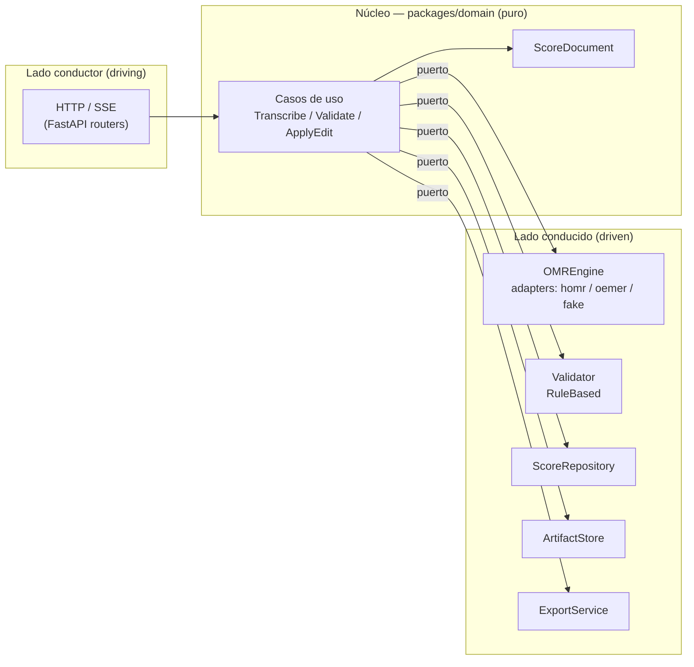

# ADR-0001: Monolito modular hexagonal (Puertos y Adaptadores)

- **Estado:** Aceptado
- **Fecha:** 2026-09-20
- **Decisores:** Arquitecto de Software, Dirección del proyecto Cadenza
- **Relacionado:** [ADR-0002](ADR-0002-score-document-anchor-index.md), [ADR-0003](ADR-0003-separacion-planos-computo.md)

---

## Contexto

Cadenza integra cuatro componentes de naturaleza heterogénea: un motor de
reconocimiento óptico de música (dependencia externa, potencialmente
reemplazable), un motor de validación por reglas de teoría musical (aporte
central de la investigación), una interfaz *Human-in-the-Loop* y un ciclo de
aprendizaje activo con entrenamiento *offline*.

El objetivo del proyecto exige dos propiedades no negociables:

1. **Bajo acoplamiento** entre la UI, el modelo OMR y el validador, para que el
   fallo o el reemplazo de uno no arrastre a los demás.
2. **Comparabilidad experimental**: la tesis debe medir el aporte del pipeline
   asistido frente a una línea base OMR no asistida, y comparar estrategias de
   aprendizaje activo entre sí. Esto solo es posible si los componentes de
   investigación se pueden sustituir sin reescribir el sistema.

Un diseño monolítico en capas tradicionales (con dependencias directas a
`music21`, `homr` y HTTP entremezcladas) impediría ambas propiedades. Una
arquitectura de microservicios, en cambio, añadiría una complejidad operativa
(frontal de red, contratos entre servicios, despliegue distribuido) injustificada
para el alcance y el tiempo de un proyecto de grado.

## Decisión

Se adopta un **monolito modular con arquitectura hexagonal (Puertos y
Adaptadores)** como estilo arquitectónico único del backend.

- El **dominio** (`packages/domain`) contiene el modelo `ScoreDocument`, las
  anclas, los `Finding` y los eventos de edición. Es código **puro**: no importa
  I/O, frameworks web, ni librerías de OMR.
- Cada capacidad externa se declara como un **puerto** (interfaz abstracta) y se
  implementa mediante uno o varios **adaptadores**:

| Puerto | Responsabilidad | Adaptadores |
|---|---|---|
| `OMREngine` | Imagen → `ScoreDocument` crudo | `HomrEngine`, `OemerEngine` (baseline), `FakeEngine` (test) |
| `Validator` | `ScoreIR` → `Finding[]` | `RuleBasedValidator` |
| `ScoreRepository` | Persistencia de sesiones y eventos | `SqlAlchemyScoreRepository` |
| `ArtifactStore` | Blobs inmutables (imágenes, MusicXML, ONNX) | `FilesystemArtifactStore`, `S3ArtifactStore` |
| `ExportService` | `ScoreDocument` → MusicXML / MIDI | `Music21Exporter` |
| `AcquisitionStrategy` | Corpus → muestras seleccionadas | `HybridAcquisition`, `UncertaintyAcquisition`, `DiversityAcquisition` |
| `ScoreRenderer` (frontend) | `ScoreIR` → superficie interactiva | `OsmdRenderer`, `VerovioRenderer` |

- La dirección de dependencias apunta **siempre hacia el dominio**: los
  adaptadores dependen del dominio, nunca al revés.

## Consecuencias

### Positivas
- **Sustitución experimental directa:** cambiar HOMR por oemer, o una estrategia
  de AL por otra, es cambiar de adaptador, sin tocar el dominio.
- **Testeabilidad:** el `FakeEngine` permite probar validación, HITL y AL sin
  cargar modelos neuronales ni GPU.
- **Aislamiento de la deuda externa:** las limitaciones de una dependencia
  AGPL o de una versión concreta quedan confinadas a un adaptador.
- Trazabilidad clara entre decisiones de diseño y código, útil para la defensa.

### Riesgos / costos
- **Disciplina requerida:** el patrón se degrada si un adaptador filtra tipos de
  la dependencia hacia el dominio (p. ej. objetos `music21` en las firmas de los
  casos de uso). Requiere revisión continua y *tests* de arquitectura.
- Mayor número de archivos y de indirección para funcionalidad trivial.
- No es un estilo que "se gane" automáticamente: hay que documentarlo (este ADR)
  y aplicarlo con rigor.

## Alternativas consideradas

1. **Monolito en capas (MVC clásico).** Descartado: acopla el dominio a
   `music21`/`homr` y hace inviable la sustitución de componentes para los
   experimentos.
2. **Microservicios** (`omr-service`, `validation-service`, `learning-service`).
   Descartado por sobredimensionado: costo operativo y de red alto, y no aporta
   al objetivo académico, que se satisface con un monolito modular.
3. **Pipeline basado en scripts** (orquestación por CLI/subprocess). Descartado:
   es la aproximación del MVP y dificulta el testeo, el versionado y la
   comparabilidad.
