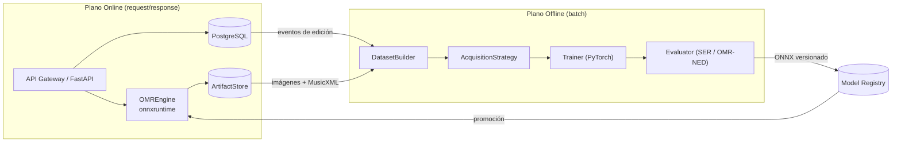

# ADR-0003: Separación estricta de planos de cómputo Online / Offline

- **Estado:** Aceptado
- **Fecha:** 2026-09-20
- **Decisores:** Arquitecto de Software, Dirección del proyecto Cadenza
- **Relacionado:** [ADR-0001](ADR-0001-monolito-modular-hexagonal.md), [ADR-0005](ADR-0005-motor-omr-homr-baseline-oemer.md), [ADR-0008](ADR-0008-active-learning-model-registry.md)

---

## Contexto

El análisis del MVP reveló una confusión de fondo: la verificación de GPU se
hacía con `torch.cuda.is_available()`, pero la inferencia real de HOMR corre
sobre **`onnxruntime`**, que no usa PyTorch. El resultado era un sistema que
reportaba "modo GPU" sin garantizar que el reconocimiento efectivamente usara
GPU, y que mezclaba, en un mismo proceso, tareas con perfiles de recurso
radicalmente distintos.

Cadenza tiene dos naturalezas de cómputo incompatibles en el mismo ciclo de
petición:

- **Inferencia**: baja latencia, orientada a peticiones, con un modelo ya
  entrenado y exportado. Debe responder en segundos y no bloquear el bucle de
  eventos.
- **Aprendizaje activo**: alto costo, orientado a lotes, con re-ejecución de
  segmentación, entrenamiento con PyTorch, evaluación y exportación. Puede durar
  horas y satura GPU/CPU.

Ejecutar el segundo dentro del request violaría la disponibilidad del primero.
Mantener una única cadena de dependencias (torch para todo) impediría optimizar
cada plano por separado.

## Decisión

Se establece una **separación estricta de dos planos de cómputo**, con contratos
explícitos entre ellos y **artefactos versionados** como único canal de
comunicación.

### Plano Online (inferencia y UI)

- **Responsabilidad:** servir peticiones de transcripción, validación, edición y
  exportación.
- **Tecnología:** FastAPI (async), `onnxruntime` (CPU o GPU según *extras*),
  PostgreSQL, `ArtifactStore`.
- **Reglas:**
  - Ninguna operación de entrenamiento ocurre en este plano.
  - El trabajo pesado de OMR se ejecuta **fuera del bucle de eventos**
    (worker/threadpool), nunca bloqueando.
  - El dispositivo realmente utilizado se reporta consultando
    `onnxruntime.get_available_providers()` (p. ej. `CUDAExecutionProvider` vs
    `CPUExecutionProvider`), no `torch.cuda`.

### Plano Offline / Batch (aprendizaje)

- **Responsabilidad:** construir datasets, seleccionar muestras, hacer
  *fine-tuning* y evaluar.
- **Tecnología:** PyTorch (pipeline de entrenamiento de HOMR), CLI de
  orquestación (`Typer`/`Make`), directorio `ml/`, configuración versionada en
  `configs/`.
- **Reglas:**
  - Se ejecuta como **job explícito**, nunca como efecto colateral de un request.
  - Consume los **eventos de edición** persistidos por el plano online.
  - Produce un **artefacto de modelo (ONNX) versionado** y un informe de
    evaluación, no un cambio de estado en caliente.

### Interfaz entre planos

El **único** canal entre planos son datos persistidos (eventos, artefactos) y el
**Model Registry**. No hay llamadas síncronas del plano online hacia el offline.

## Consecuencias

### Positivas
- **Aislamiento de fallos y de rendimiento:** un entrenamiento largo no degrada
  la atención de peticiones.
- **Optimización independiente:** la imagen de inferencia puede ser ligera
  (onnxruntime), mientras la de entrenamiento es pesada (CUDA/PyTorch).
- **Reproducibilidad experimental:** cada corrida de entrenamiento es un job con
  config versionada y semillas, requisito del capítulo de experimentación.
- **Veracidad del reporte de hardware:** elimina el falso positivo de GPU del MVP.

### Riesgos / costos
- **Dos entornos de dependencias** que mantener (runtime vs. entrenamiento),
  con riesgo de deriva de versiones. Se mitiga fijando `pyproject` por plano y
  con una verificación de compatibilidad del formato ONNX.
- **Latencia de lazo de aprendizaje:** las mejoras no son inmediatas; el ciclo es
  inherentemente por lotes. Es una propiedad aceptada y documentada, no un fallo.
- Requiere un **Model Registry** mínimo (versiones, métricas, promoción) que hay
  que construir y gobernar.

## Alternativas consideradas

1. **Entrenamiento dentro del request o en *background* del mismo proceso.**
   Descartado: impredecible, bloquea recursos y es incompatible con la
   disponibilidad del servicio.
2. **Un solo entorno con PyTorch para todo.** Descartado: infla la imagen de
   inferencia y no refleja la realidad de HOMR (ONNX), perpetuando el error del MVP.
3. **Microservicio de entrenamiento separado.** Descartado por ahora: un job por
   CLI con artefactos versionados cubre el caso de uso sin costo operativo
   adicional; queda como evolución natural si se requiere orquestación distribuida.
