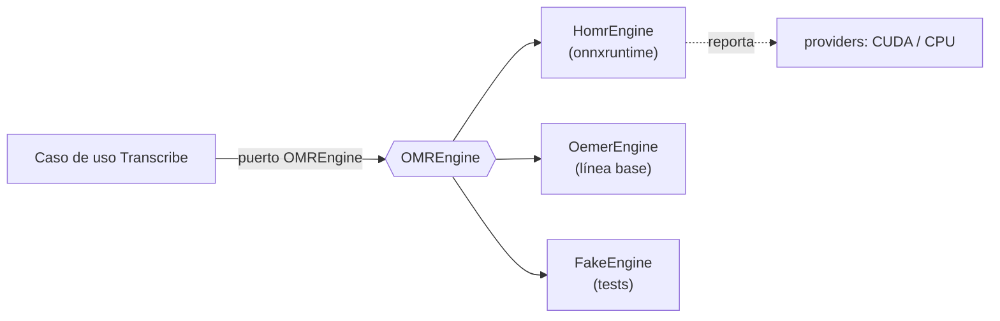

# ADR-0005: HOMR/ONNX como motor OMR base y oemer como línea base

- **Estado:** Aceptado
- **Fecha:** 2026-09-20
- **Decisores:** Arquitecto de Software, Dirección del proyecto Cadenza
- **Relacionado:** [ADR-0001](ADR-0001-monolito-modular-hexagonal.md), [ADR-0003](ADR-0003-separacion-planos-computo.md), [ADR-0008](ADR-0008-active-learning-model-registry.md)

---

## Contexto

El proyecto requiere un motor de OMR que transforme imágenes de partituras
(impresas y manuscritas modernas, monofónicas y de piano simple) en símbolos
editables. La revisión sistemática y el MVP condujeron primero a `oemer` como
referencia; sin embargo, el análisis técnico de la implementación vigente reveló
hechos que obligan a reconsiderar la elección y, sobre todo, su **modo de
integración**:

- El MVP detectaba GPU con `torch.cuda.is_available()`, pero HOMR **no usa
  PyTorch en inferencia**: usa **`onnxruntime`** (extras `homr[cpu]` /
  `homr[cuda]`). El reporte de "modo GPU" era, por tanto, engañoso.
- HOMR se invocaba por **subprocess con scraping de salida** y múltiples comandos
  candidatos, lo que resultaba frágil, no testeable y no apto para comparación
  experimental.
- Ambas librerías arrastran requisitos de versión específicos (HOMR exige
  `numpy >= 2.4`, Python 3.11/3.12) y HOMR tiene licencia **AGPL-3.0**.

La tesis necesita, además, una **línea base OMR no asistida** contra la cual medir
el aporte del sistema asistido (objetivo específico de evaluación).

## Decisión

Se adopta **HOMR como motor OMR base**, integrado mediante un **adaptador
`HomrEngine`** detrás del puerto `OMREngine`, con las siguientes condiciones:

1. **Integración in-process**, invocando la API de HOMR directamente (o su
   entrypoint programático), **prohibiendo** la invocación por subprocess y el
   scraping de salida que usaba el MVP.
2. **Runtime de inferencia `onnxruntime`**, con selección de proveedor explícita
   (`CUDAExecutionProvider` si está disponible; `CPUExecutionProvider` en caso
   contrario). El dispositivo efectivo se **reporta desde `onnxruntime`**, nunca
   desde `torch`.
3. **`oemer` se conserva como adaptador de línea base** (`OemerEngine`) para la
   comparación experimental, no como motor principal.
4. **`FakeEngine`** obligatorio para pruebas: permite ejercitar M2, M3 y M4 sin
   cargar modelos ni requerir GPU.
5. El **preprocesado** de imagen (deskew, binarización, control de DPI) se modela
   como etapa configurable dentro del adaptador, para poder medirlo
   experimentalmente.
6. Se reconoce y documenta la licencia **AGPL-3.0** de HOMR como restricción de
   distribución.

## Consecuencias

### Positivas
- **Alineación con la realidad del motor:** se elimina el falso positivo de GPU
  y se puede afirmar con evidencia el hardware utilizado.
- **Experimento de línea base viable:** el puerto `OMREngine` permite comparar
  HOMR vs. oemer sobre el mismo corpus y las mismas métricas.
- **Testeabilidad y CI:** el `FakeEngine` desacopla la suite de pruebas del peso
  de los modelos.
- **Reproducibilidad:** versiones fijadas en `pyproject` y motor declarado en la
  `Provenance` de cada `ScoreDocument`.

### Riesgos / costos
- **Compatibilidad de dependencias:** `numpy >= 2.4` de HOMR obliga a usar
  `music21 >= 10`; hay que fijar y verificar el árbol de dependencias.
- **Extracción de entrenamiento:** el *fine-tuning* (ADR-0008) debe acoplarse al
  pipeline PyTorch de HOMR y exportar a ONNX; existe acoplamiento con su formato
  interno de datos.
- **Licencia AGPL-3.0:** condiciona una eventual distribución comercial; es
  aceptable para el ámbito académico, pero debe declararse.

## Alternativas consideradas

1. **`oemer` como motor principal.** Descartado: se prefiere HOMR como base por su
   pipeline de dos etapas (segmentación UNet + reconocimiento por transformer) y
   porque el entorno ya lo referencia; oemer queda como *baseline* valioso.
2. **Mantener la invocación por subprocess.** Descartado: frágil, no testeable y
   contrario al bajo acoplamiento (ADR-0001).
3. **Usar PyTorch directamente para inferencia.** Descartado: HOMR ya exporta a
   ONNX; añadir PyTorch al runtime infla el despliegue sin beneficio.
4. **Desarrollar un motor OMR propio.** Descartado por alcance: el aporte de la
   tesis es la validación, la interacción y el aprendizaje activo, no reentrenar
   un OMR desde cero.
