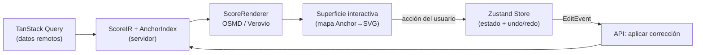

# ADR-0006: Renderizado reactivo (OSMD/Verovio) y estado editorial (Zustand)

- **Estado:** Aceptado
- **Fecha:** 2026-09-20
- **Decisores:** Arquitecto de Software, Dirección del proyecto Cadenza
- **Relacionado:** [ADR-0002](ADR-0002-score-document-anchor-index.md), [ADR-0007](ADR-0007-edit-events-inmutables.md)

---

## Contexto

El Módulo 3 exige una interfaz *Human-in-the-Loop* que no se limite a **ver** la
partitura, sino a **corregirla** sobre una representación fiel, con:

- *overlays* de error anclados a eventos (M2),
- edición de altura / duración / alteración por nota (M3),
- imagen original en paralelo con recorte por evento,
- reproducción con cursor sincronizado,
- registro de cada operación como dato estructurado (M4).

El MVP usaba **OpenSheetMusicDisplay (OSMD)** únicamente como visor de solo
lectura. OSMD renderiza correctamente pero **no ofrece edición de eventos**: no
expone un modelo mutable de la partitura, sino una proyección SVG. Confundir
"renderizar" con "editar" fue el error conceptual del MVP.

Además, el editor introduce estado complejo: selección múltiple, edición en
curso, historial de deshacer/rehacer sincronizado con el backend, y resaltado
cruzado entre findings, anclas y audio. Un estado manejado con `useState`
disperso, como en el MVP, no escala.

## Decisión

Se separa **renderizado** de **edición**, y se formaliza el estado del editor:

### Renderizado: librerías de notación tras el puerto `ScoreRenderer`

- La UI consume un puerto `ScoreRenderer` (contrato del frontend) con dos
  adaptadores posibles:
  - **`OsmdRenderer`** (OpenSheetMusicDisplay): renderizado SVG estable y rápido,
    **instrumentado** para exponer un **mapa `Anchor → elemento SVG`** que habilita
    *overlays* y selección.
  - **`VerovioRenderer`**: alternativa para renderizado de alta fidelidad y
    control fino de la interacción, contemplada como evolución si OSMD resulta
    insuficiente para la edición.
- Sea cual sea el renderizador, la **edición no ocurre sobre el SVG**, sino sobre
  el `ScoreIR`/anclas; tras cada operación se vuelve a renderizar (flujo
  unidireccional de datos).

### Estado editorial: Zustand

- Se adopta **Zustand** como gestor de estado del cliente para el editor, por su
  modelo minimalista, su ausencia de *boilerplate* y su facilidad para implementar
  una **pila de undo/redo** alineada con los eventos de edición (ADR-0007).
- El **estado del servidor** (transcripciones, findings, versiones) se gestiona
  aparte con **TanStack Query**, evitando mezclar caché remota con estado de
  edición local.

### Flujo unidireccional

## Consecuencias

### Positivas
- **Edición real:** se corrige el defecto conceptual del MVP (visor vs. editor).
- **Independencia del renderizador:** cambiar OSMD por Verovio no afecta la lógica
  de edición ni el modelo de datos.
- **Undo/redo coherente** con el log inmutable de eventos (ADR-0007) y
  persistencia fiable.
- **Separación de responsabilidades de estado:** remoto (TanStack Query) vs.
  editorial (Zustand), evitando efectos colaterales difíciles de depurar.

### Riesgos / costos
- **Instrumentar OSMD** para mapear anclas a elementos SVG es trabajo no trivial y
  sensible a versiones de la librería.
- **Re-render completo por edición** puede penalizar el rendimiento en partituras
  largas; se mitiga con render por sistema/compás y *memoization*.
- Introducir Zustand + TanStack Query añade dos dependencias que el equipo debe
  dominar; se justifica por la complejidad inherente del editor.

## Alternativas consideradas

1. **Editar directamente sobre el DOM/SVG generado por OSMD.** Descartado: frágil,
   se pierde al re-renderizar y acopla la lógica al *markup* de una librería.
2. **Solo OSMD como visor (como el MVP).** Descartado: no cumple el objetivo HITL.
3. **Editor propio desde cero (Canvas/WebGL).** Descartado por alcance: enorme
   esfuerzo de notación sin aportar a la contribución científica.
4. **Redux Toolkit en lugar de Zustand.** Aceptable, pero descartado por mayor
   *boilerplate* sin ventaja clara para el tamaño del estado del editor.
