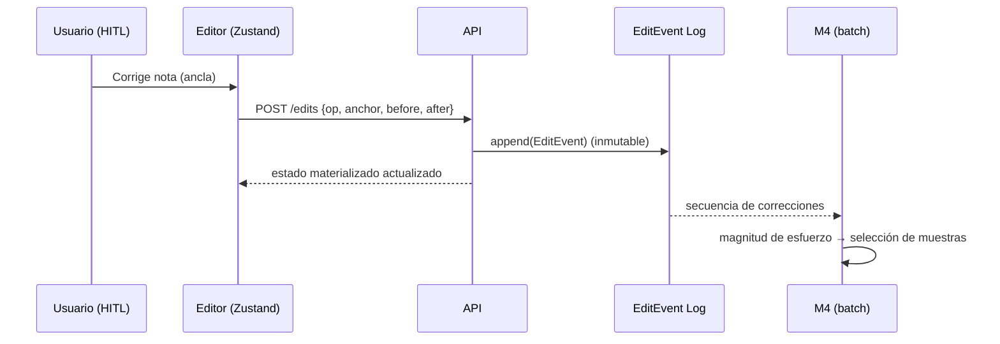

# ADR-0007: Correcciones HITL como eventos inmutables sobre anclas

- **Estado:** Aceptado
- **Fecha:** 2026-09-20
- **Decisores:** Arquitecto de Software, Dirección del proyecto Cadenza
- **Relacionado:** [ADR-0002](ADR-0002-score-document-anchor-index.md), [ADR-0004](ADR-0004-persistencia-postgresql-jsonb.md), [ADR-0006](ADR-0006-render-editor-osmd-verovio-zustand.md), [ADR-0008](ADR-0008-active-learning-model-registry.md)

---

## Contexto

El ciclo de aprendizaje activo (M4) requiere que las correcciones humanas sean
**datos estructurados y analizables**, no solo una partitura final. De cada
interacción el sistema debe poder responder:

- ¿qué cambió exactamente y en qué evento?
- ¿cuánta corrección hizo falta (magnitud del esfuerzo)?
- ¿cuál era el valor crudo del OMR y cuál el valor corregido?

El MVP no capturaba nada de esto: cada corrección era una mutación efímera del
estado de React y, al descartar los temporales, no quedaba rastro. Un modelo de
persistencia basado en "el MusicXML final" pierde la información de proceso, que
es precisamente la señal de valor para el aprendizaje activo y para las métricas
de esfuerzo cognitivo del objetivo de evaluación.

Además, para la UX del editor se necesita **deshacer/rehacer**, y para la tesis
se necesita **auditoría** de las modificaciones.

## Decisión

Las correcciones humanas se modelan como **eventos inmutables (event-sourcing)
anclados a eventos musicales** mediante las anclas del ADR-0002.

### Modelo de evento

```text
EditEvent = {
  id:            uuid,
  document_id:   uuid,        # ScoreDocument afectado
  seq:           int,         # orden monotónico dentro del documento
  anchor:        Anchor,      # evento musical objetivo (ADR-0002)
  op:            enum,        # SetPitch | SetDuration | SetAccidental
                              # | InsertEvent | DeleteEvent | SetClef | SetKey
  before:        json,        # valor previo (null en inserción)
  after:         json,        # valor nuevo  (null en borrado)
  author:        string,      # usuario/sesión
  created_at:    timestamp
}
```

### Propiedades

- **Inmutabilidad:** un evento jamás se modifica ni se borra; el estado actual del
  `ScoreDocument` es el resultado de **aplicar la secuencia de eventos** sobre el
  `ScoreIR` crudo. Se puede materializar una vista (`current_ir`) para lectura
  rápida, pero su reconstrucción siempre es posible desde el log.
- **Anclaje:** `op` y `anchor` bastan para localizar y describir el cambio sin
  ambigüedad, incluso tras serializar a MusicXML.
- **Deshacer/rehacer:** se implementa **registrando el evento inverso** (o
  recalculando desde el log), no mutando ni eliminando historia.
- **Señal para M4:** la secuencia de eventos por documento alimenta directamente
  la **magnitud de corrección** usada por la estrategia de aprendizaje activo
  (ADR-0008) y las métricas de intervenciones manuales por compás.



## Consecuencias

### Positivas
- **Datos ricos para la investigación:** se conserva el proceso (qué cambió, cuánto,
  desde qué valor), no solo el resultado.
- **Auditoría y trazabilidad totales**, alineadas con la `Provenance` del
  `ScoreDocument`.
- **Undo/redo robusto** y consistente con la persistencia.
- **Desacople temporal:** el plano offline puede reproducir exactamente qué vio y
  qué corrigió el humano, requisito para entrenar con datos fieles.

### Riesgos / costos
- **Materialización:** mantener una vista `current_ir` requiere recomputar o
  actualizar incrementalmente; hay que definir el punto de materialización por
  rendimiento.
- **Crecimiento del log:** en uso intensivo el volumen de eventos crece; se mitiga
  con compactación periódica (*snapshots*) sin perder el original.
- **Complejidad en operaciones estructurales** (insertar/borrar eventos) que
  desplazan índices: requiere reasignar o estabilizar anclas, tema de diseño a
  cuidar en la implementación de M3.

## Alternativas consideradas

1. **Guardar solo el MusicXML corregido (estado final).** Descartado: pierde la
   señal de esfuerzo y de error necesaria para M4 y para la evaluación.
2. **Mutación in-place del `ScoreIR` sin log.** Descartado: sin auditoría ni
   undo/redo fiable, y sin datos de proceso.
3. **Diff textual de MusicXML (raw vs. final).** Descartado como fuente primaria:
   es costoso de interpretar y frágil ante reordenamientos; el diff se **deriva**
   del log de eventos, que sí es semántico.
