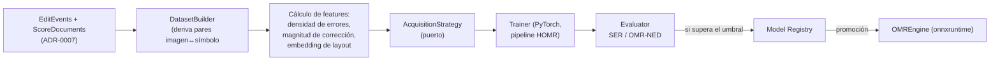

# ADR-0008: Estrategia de Active Learning y Model Registry

- **Estado:** Aceptado
- **Fecha:** 2026-09-20
- **Decisores:** Arquitecto de Software, Dirección del proyecto Cadenza
- **Relacionado:** [ADR-0003](ADR-0003-separacion-planos-computo.md), [ADR-0004](ADR-0004-persistencia-postgresql-jsonb.md), [ADR-0005](ADR-0005-motor-omr-homr-baseline-oemer.md), [ADR-0007](ADR-0007-edit-events-inmutables.md)

---

## Contexto

El cuarto componente de Cadenza es un ciclo de **aprendizaje activo**: usar las
correcciones de los usuarios para mejorar progresivamente el reconocimiento con
el menor esfuerzo humano posible.

La literatura revisada (§05) obliga a no asumir una estrategia ingenua: el estudio
directo más cercano (AL-003, 2025) encontró que la **selección por incertidumbre
NO fue efectiva** en un manuscrito medieval, y recomienda métodos más utilizables
en escenarios de datos escasos. Cadenza opera, además, en ese régimen de datos
escasos (corpus académico pequeño). Por tanto:

- No basta con "samplear por baja confianza".
- Se requiere poder **comparar experimentalmente** distintas estrategias.
- El aprendizaje activo y el *fine-tuning* son costosos y deben vivir en el
  **plano offline por lotes** (ADR-0003), no en el request.
- El resultado del entrenamiento debe poder **promoverse de forma gobernada** al
  motor de inferencia, con evaluación y trazabilidad.

## Decisión

Se implementa un **ciclo de aprendizaje activo por lotes con estrategia
intercambiable y registro de modelos versionado**.

### 1. Corriente de datos (plano offline)

### 2. `AcquisitionStrategy` como puerto

Se define un puerto con varias implementaciones, de modo que la estrategia sea un
**objeto de estudio experimental**, no una decisión enterrada en el código:

| Estrategia | Fundamento |
|---|---|
| `UncertaintyAcquisition` | Línea base clásica (baja confianza); se incluye para **reproducir el hallazgo negativo** de AL-003. |
| `DiversityAcquisition` | Cobertura del espacio de características (clustering). |
| `HybridAcquisition` | Combinación de **densidad de errores del validador (M2) + magnitud de corrección (M3) + diversidad**. Es la **apuesta principal**. |

La `HybridAcquisition` se justifica por el hallazgo de AL-003 y por el carácter
neuro-simbólico de Cadenza: usa la señal del validador como *proxi* de
incertidumbre, pero la mitiga con diversidad.

### 3. `DatasetBuilder`

Traduce `(imagen original, ScoreIR crudo, ScoreIR corregido, EditEvents)` a
**tuplas de entrenamiento** compatibles con el formato interno del pipeline de
HOMR. La alineación se realiza por **anclas** (ADR-0002). La construcción se hace
en lote, re-ejecutando la segmentación cuando es necesario, nunca en línea.

### 4. `Model Registry` y promoción

- Cada corrida produce un artefacto **ONNX versionado** más métricas
  (`SER`, `OMR-NED`), versión de dataset y configuración de entrenamiento.
- La **promoción** de una nueva versión al plano online es una **decisión
  explícita** condicionada a superar un umbral de evaluación; nunca es automática
  por el solo hecho de haber entrenado.
- Todo `ScoreDocument` registra en su `Provenance` la versión de modelo usada.

### 5. Reproducibilidad

- Configuraciones de corrida versionadas en `configs/` y semillas fijas.
- Dataset y artefactos direccionados por hash (ADR-0004) → experimentos
  reconstruibles.

## Consecuencias

### Positivas
- **Comparabilidad experimental:** las estrategias son implementaciones de un
  mismo puerto; medir su efecto es un cambio de configuración.
- **Alineación con la evidencia:** la apuesta por diversidad + magnitud de
  corrección se fundamenta en AL-003, no en una intuición.
- **Gobierno del modelo:** la promoción con umbral y métricas evita degradar el
  sistema silenciosamente.
- **Aprovechamiento del carácter neuro-simbólico:** el validador (M2) aporta la
  señal de incertidumbre que el `DatasetBuilder` convierte en criterio de
  selección.

### Riesgos / costos
- **Deriva o sesgo del corpus:** si las correcciones se concentran en ciertos
  tipos de partitura, el modelo puede sobreajustar; la diversidad mitiga, pero hay
  que monitorearlo.
- **Complejidad del `DatasetBuilder`:** alinear símbolos corregidos con recortes de
  segmentación es la tarea de ingeniería más delicada del proyecto.
- **Costo computacional:** el *fine-tuning* exige GPU; si no está disponible, el
  alcance se limita a un corrector ligero post-proceso (ver consecuencias de
  ADR-0003/ADR-0005).
- **Breakdown de dependencias:** el pipeline de entrenamiento de HOMR puede fijar
  versiones de PyTorch que difieran del runtime ONNX; se gobierna por separado
  (ADR-0003).

## Alternativas consideradas

1. **Solo *uncertainty sampling*.** Descartado como apuesta: la evidencia
   (AL-003) muestra que puede ser inefectiva en datos escasos; se mantiene solo
   como *baseline* reproducible.
2. **Fine-tuning continuo/online (on-device), TFLite.** Descartado por decisión de
   alcance del proyecto: se abandona el Edge Learning en favor de un ajuste
   **batch en servidor**, más viable y defendible.
3. **Reentrenar siempre y promover automáticamente.** Descartado: sin umbral de
   evaluación se arriesga a degradar el servicio; se exige promoción gobernada.
4. **No versionar modelos.** Descartado: rompe la reproducibilidad y la
   trazabilidad exigidas por el capítulo experimental.
