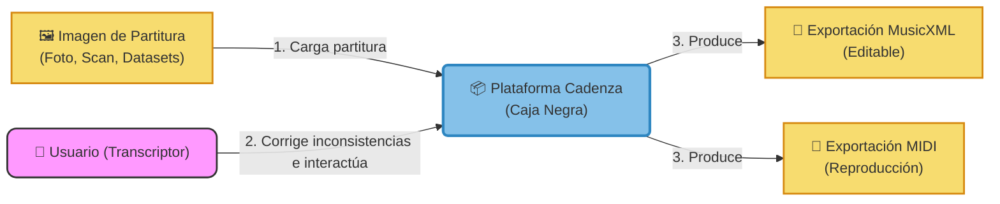

# Arquitectura General y Diagrama de Bloques de Construcción (DBB)

Este documento describe la arquitectura de software extremo a extremo (E2E) de la plataforma **Cadenza**. El diseño sigue la metodología de **Diagramas de Bloques de Construcción (DBB)**, estructurada en niveles de detalle (caja negra y caja blanca).

---

## 1. Nivel 1: Contexto del Sistema (Caja Negra)

En este nivel de abstracción más alto, la plataforma **Cadenza** se concibe como una sola entidad o caja negra. Sus interacciones principales son con el usuario final (transcriptor) y los formatos de datos externos de entrada y salida.



* **Entradas:** Imágenes de partituras (fotografías o escaneos en formatos PNG/JPG) procedentes de archivos personales o de los datasets públicos de evaluación (PrIMuS, SMB, MUSCIMA++).
* **Salidas:** Archivos de música simbólica en formato **MusicXML 4.0** (editable en cualquier editor convencional) y **MIDI 1.0** (para reproducción audible de la transcripción).
* **Actores:** El usuario transcriptor, quien supervisa la salida y edita activamente los errores señalados por el motor de validación.

---

## 2. Nivel 2: Arquitectura del Sistema (Caja Blanca / DBB E2E)

En este nivel, abrimos la caja negra de **Cadenza** y exponemos su estructura interna. El sistema se divide en tres capas fundamentales: **Presentación (Frontend)**, **Lógica de Negocio (Backend)** y **Datos (Persistencia)**.

```mermaid
graph TD
    %% Estilos de Nodos
    classDef actor fill:#f9f,stroke:#333,stroke-width:2px,rx:10px,ry:10px;
    classDef client fill:#85C1E9,stroke:#2E86C1,stroke-width:2px;
    classDef server fill:#82E0AA,stroke:#239B56,stroke-width:2px;
    classDef data fill:#F5CBA7,stroke:#D35400,stroke-width:2px;
    classDef external fill:#F7DC6F,stroke:#D68910,stroke-width:2px;

    %% Actores y Entornos Externos
    Usuario["👤 Usuario (Transcriptor)"]:::actor
    PartituraImg["🖼️ Partitura Original (Imagen/Foto)"]:::external
    SalidaXML["📄 Archivo MusicXML (Editable)"]:::external
    SalidaMIDI["🎵 Archivo MIDI (Reproducción)"]:::external

    subgraph Plataforma Cadenza [Plataforma de Digitalización Asistida]
        %% Frontend
        subgraph Capa de Presentación (Frontend - Cliente UI)
            UI["💻 UI de Corrección Asistida (HITL)"]:::client
            Visor["🎼 Visor Interactivo (Renderizado SVG/Canvas)"]:::client
            Editor["🛠️ Panel de Edición de Símbolos"]:::client
        end

        %% Backend
        subgraph Capa de Lógica de Negocio (Backend API Server)
            Orquestador["⚙️ Orquestador & API Gateway"]:::server
            
            subgraph Motor de Transcripción (OMR)
                OemerWrapper["🤖 Wrapper OMR (oemer)"]:::server
            end

            subgraph Motor de Validación Musical
                Validador["🎼 Reglas de Teoría Musical (music21)"]:::server
                Auditor["🔍 Auditor de Inconsistencias"]:::server
            end

            subgraph Módulo de Aprendizaje Activo (Active Learning)
                ALEngine["🧠 Módulo AL (YOLO/oemer fine-tuning)"]:::server
                Selector["🎯 Selector de Muestras de Valor"]:::server
            end

            Exportador["📤 Generador de Formatos (MusicXML/MIDI)"]:::server
        end

        %% Persistencia
        subgraph Capa de Datos (Almacenamiento Local)
            DB[("💾 Base de Datos Local (SQLite/Archivos)
            - Imágenes de Partituras
            - MusicXML Intermedios
            - Historial de Correcciones
            - Modelos de OMR")]:::data
        end
    end

    %% Relaciones / Flujo Extremo a Extremo
    %% 1. Entrada de datos
    PartituraImg -->|"1. Sube imagen"| UI
    UI -->|"2. Envía archivo"| Orquestador

    %% 2. Procesamiento OMR
    Orquestador -->|"3. Ejecuta pipeline"| OemerWrapper
    OemerWrapper -->|"4. Genera MusicXML crudo"| Orquestador

    %% 3. Validación Musical
    Orquestador -->|"5. Envía para auditoría"| Validador
    Validador --> Auditor
    Auditor -->|"6. Reporta Zonas Sospechosas (JSON)"| Orquestador

    %% 4. Persistencia inicial y retorno a UI
    Orquestador -->|"7. Almacena estado"| DB
    Orquestador -->|"8. Retorna Imagen + XML + Errores"| UI
    UI --> Visor
    UI --> Editor

    %% 5. Interacción del Usuario e HITL
    Usuario -->|"9. Revisa alertas y edita"| Editor
    Editor -->|"10. Corrige alturas, ritmos y duraciones"| Visor
    Visor -->|"11. Guarda partitura corregida"| UI
    UI -->|"12. Envía correcciones"| Orquestador

    %% 6. Aprendizaje Activo
    Orquestador -->|"13. Almacena par original/corregido"| DB
    DB --> Selector
    Selector -->|"14. Filtra muestras diversas/complejas"| ALEngine
    ALEngine -->|"15. Reentrena/Ajusta parámetros"| OemerWrapper

    %% 7. Exportación Final
    Orquestador -->|"16. Exporta resultado validado"| Exportador
    Exportador --> SalidaXML
    Exportador --> SalidaMIDI
```

---

## 3. Descripción Detallada de los Bloques de Construcción

### Capa de Presentación (Frontend)

1. **UI de Corrección Asistida (HITL):** 
   * **Descripción:** Interfaz de usuario interactiva (desarrollada en HTML5/JS) donde el transcriptor carga sus partituras, visualiza los resultados y gestiona el flujo de trabajo.
   * **Responsabilidad:** Coordinar las vistas y comunicarse con el backend API a través de llamadas REST.
2. **Visor Interactivo:** 
   * **Descripción:** Canvas o visor SVG interactivo (basado en librerías de renderizado musical simbólico como *OpenSheetMusicDisplay*) que dibuja la partitura digital sobrepuesta a la imagen original o de manera paralela.
   * **Responsabilidad:** Pintar los errores de validación mediante recuadros de advertencia (overlays de color rojo/amarillo) en los compases o notas que fallaron las pruebas sintácticas.
3. **Panel de Edición de Símbolos:**
   * **Descripción:** Panel de herramientas rápido que permite al usuario modificar la altura, duración o presencia de un símbolo musical (notas, alteraciones, compás) directamente sobre la partitura renderizada.
   * **Responsabilidad:** Capturar las acciones de edición y actualizar el modelo simbólico de la partitura.

### Capa de Lógica de Negocio (Backend)

1. **Orquestador & API Gateway:**
   * **Descripción:** Servidor API en Python (FastAPI/Flask) que coordina los subsistemas del backend y responde a las solicitudes del Frontend.
   * **Responsabilidad:** Recibir la imagen, llamar al motor OMR, dirigir la validación, persistir el estado de la sesión y empaquetar los resultados para el cliente.
2. **Wrapper OMR (oemer):**
   * **Descripción:** Envoltorio sobre la biblioteca de redes neuronales de `oemer` para segmentación de pentagramas, clasificación de glifos y ensamblaje de la partitura.
   * **Responsabilidad:** Tomar una imagen cruda y generar el archivo MusicXML inicial (que contiene errores nativos del reconocimiento).
3. **Reglas de Teoría Musical (music21):**
   * **Descripción:** Motor de reglas lógicas construido utilizando el toolkit de musicología computacional `music21`.
   * **Responsabilidad:** Parsear el MusicXML y aplicar chequeos lógicos (ej. sumar las duraciones en cada compás para compararlas con la métrica definida).
4. **Auditor de Inconsistencias:**
   * **Descripción:** Compilador de alertas de error.
   * **Responsabilidad:** Transformar los errores detectados en el paso de reglas teóricas en una lista estructurada (en formato JSON) con coordenadas de compás, tipo de error y notas sospechosas para que el frontend las dibuje.
5. **Selector de Muestras de Valor:**
   * **Descripción:** Algoritmo del ciclo de Aprendizaje Activo encargado de la estrategia de selección de muestras (Active Learning Pool).
   * **Responsabilidad:** En lugar de seleccionar por confianza simple (la cual es ineficaz según AL-003), selecciona partituras basadas en su **diversidad de errores** reportados por el Auditor y en la magnitud de las correcciones del transcriptor.
6. **Módulo de Aprendizaje Activo (AL Engine):**
   * **Descripción:** Pipeline de reentrenamiento/ajuste fino.
   * **Responsabilidad:** Tomar los pares de imágenes y MusicXML corregidos por el usuario, formatearlos como datos de entrenamiento y realizar *fine-tuning* de los modelos de detección de símbolos de `oemer`.
7. **Generador de Formatos (Exportador):**
   * **Descripción:** Serializador final de datos.
   * **Responsabilidad:** Convertir el archivo MusicXML ya corregido y validado a su versión final editable, así como sintetizar el audio/evento en formato MIDI.

### Capa de Datos (Persistencia)

1. **Base de Datos Local / Almacenamiento:**
   * **Descripción:** Estructura de almacenamiento local en archivos y base de datos relacional ligera (SQLite).
   * **Responsabilidad:** Almacenar de forma segura el historial de transcripciones, los metadatos de las correcciones del usuario (insumo para medir el esfuerzo cognitivo y evaluar la UX), las imágenes originales y los pesos actualizados de los modelos de aprendizaje profundo de OMR.
