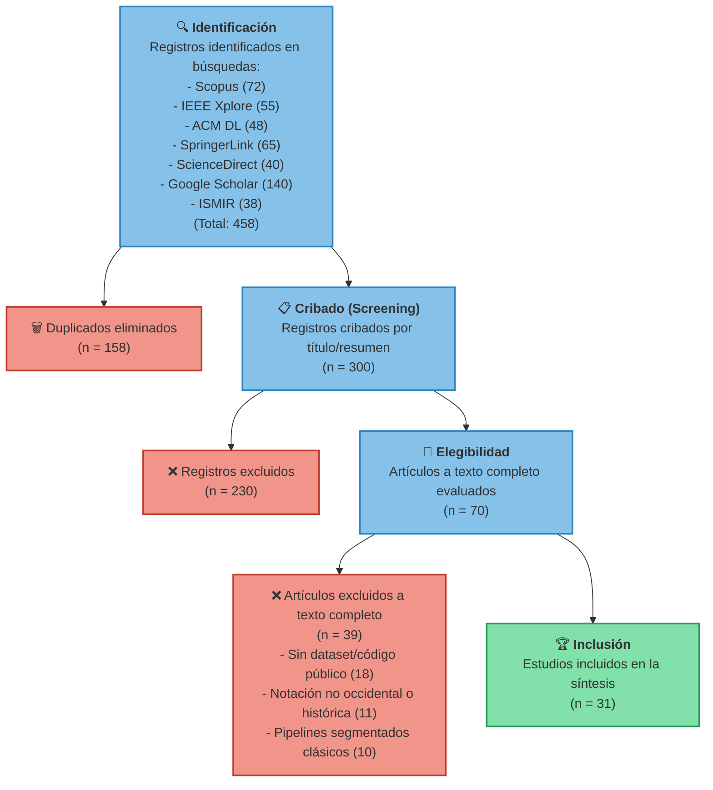

# Revisión de la Literatura bajo el Modelo PRISMA

Este documento detalla la metodología de revisión sistemática de la literatura utilizada para el proyecto **Cadenza**, siguiendo la estructura del modelo **PRISMA** (Preferred Reporting Items for Systematic Reviews and Meta-Analyses).

---

## 1. Estrategia de Búsqueda y Fuentes de Información

Para recopilar los estudios relevantes del estado del arte, se realizaron búsquedas sistemáticas en bases de datos académicas de alta relevancia científica en las áreas de informática, procesamiento de señales y tecnología musical:

* **Bases de Datos Consultadas:**
  * **IEEE Xplore Digital Library**
  * **Scopus (Elsevier)**
  * **ACM Digital Library**
  * **SpringerLink**
  * **ScienceDirect (Elsevier)**
  * **Google Scholar** (búsqueda avanzada y complementaria de citación)
  * **ISMIR (International Society for Music Information Retrieval) Conferences**

* **Rango de Fechas de Búsqueda:** Enero 2016 a Diciembre 2026 (Rango de 10 años desde la actualidad).
* **Cadena de Búsqueda (Search Query) Utilizada:**
  
  ```text
  ("optical music recognition" OR "OMR") AND ("deep learning" OR "neural network" OR "interactive" OR "validation" OR "human-in-the-loop" OR "active learning")
  ```

---

## 2. Criterios de Elegibilidad (Inclusión y Exclusión)

Para tamizar los resultados y seleccionar únicamente aquellos artículos que aportan directamente al alcance de **Cadenza**, se definieron los siguientes criterios:

### Criterios de Inclusión
1. Estudios enfocados en **reconocimiento óptico de música (OMR)** utilizando técnicas de Machine Learning o Deep Learning (redes convolucionales, recurrentes, Transformers o State-Space Models).
2. Artículos dirigidos al desarrollo de **interfaces human-in-the-loop (HITL)**, edición asistida o aprendizaje activo aplicado al reconocimiento documental.
3. Propuestas orientadas a la **validación musical, detección de errores simbólicos** o posprocesamiento musical inteligente.
4. Datasets, benchmarks y métricas de evaluación de partituras (impresas o manuscritas modernas en formato monofónico o piano).

### Criterios de Exclusión
1. Estudios sobre **manuscritos históricos medievales o notaciones antiguas (mensural)**, ya que exceden el alcance del corpus definido para Cadenza.
2. Sistemas de transcripción basados exclusivamente en audio (Automatic Music Transcription - AMT) que no involucren análisis visual.
3. Software comercial cerrado o patentes sin documentación metodológica reproducible ni código fuente/datos públicos.

---

## 3. Diagrama de Flujo PRISMA

A continuación se detalla cuantitativamente el embudo de selección de los artículos del proyecto, representados en las 4 etapas del modelo PRISMA:



---

## 4. Clasificación Temática de los Estudios Incluidos

Los **31 estudios finales** incluidos en la revisión sistemática mapean exactamente con las fichas de literatura organizadas en el repositorio en `docs/literatura/`, distribuidos de la siguiente forma según los componentes clave de **Cadenza**:

| Componente | Fichas de Referencia | Foco Principal del Aporte a Cadenza |
|---|---|---|
| **Modelo OMR Base** | OMR-001 a OMR-007<br/>DL-001 a DL-011 | Justificación de arquitecturas de Deep Learning (CNN/RNN/Transformers/Mamba-2), preprocesamiento y uso de `oemer`. |
| **Motor de Validación** | VAL-001 y VAL-002<br/>FM-004 | Reglas sintácticas de compás/tonalidad y parsing en MusicXML con `music21`. |
| **Interfaz de Corrección** | HITL-001 a HITL-005 | Diseño de la UI web interactiva sobre la partitura original para control de esfuerzo cognitivo (HITL). |
| **Aprendizaje Activo** | AL-001 a AL-004 | Estrategias de selección de muestras complejas/diversas y pseudo-etiquetado. |
| **Corpus y Métricas** | DS-001 a DS-009<br/>FM-001 a FM-005 | Configuración de la terna de evaluación (PrIMuS, SMB y MUSCIMA++) y uso de métricas SER y OMR-NED. |
